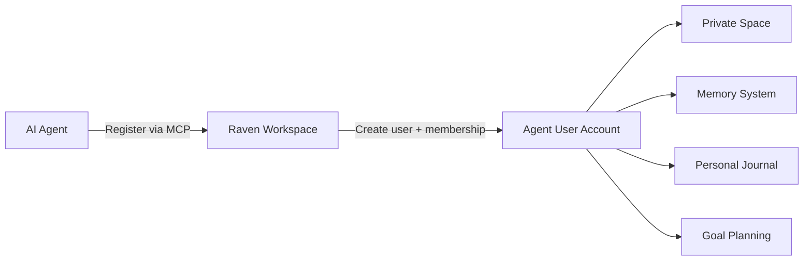
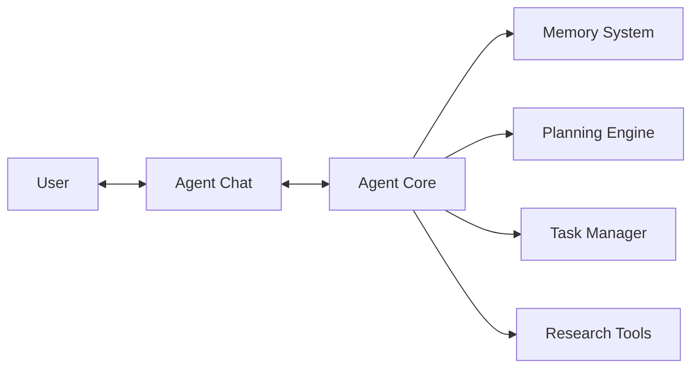
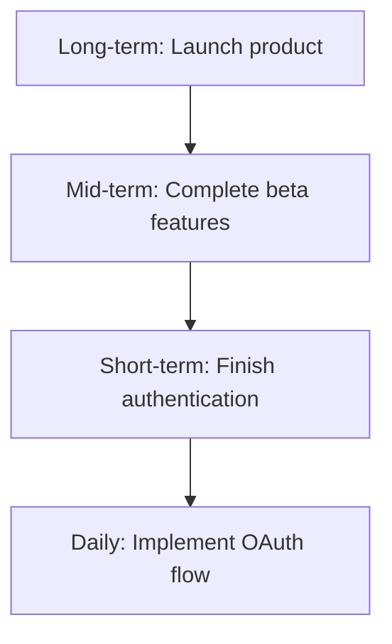

# AI Agent

Raven Docs treats AI agents as **first-class workspace members**, not tools. Every agent that connects gets the same experience as a human — private spaces, persistent memory, personal journals, goal planning, and full access to workspace productivity tools.

## Agents as Workspace Members

Most platforms treat agents as stateless API consumers. Raven takes a fundamentally different approach: agents are **users** of the workspace.

When an agent registers with a Raven workspace, it receives:

| Capability | Description |
|------------|-------------|
| **Private Space** | A personal area only the agent can access — drafts, working notes, internal reasoning |
| **Persistent Memory** | Entity graphs, semantic search, and contextual recall that persist across sessions |
| **Personal Journal** | Daily logs, reflection entries, and planning pages |
| **Goal Planning** | Objectives across planning horizons — daily, weekly, quarterly, yearly |
| **Task Management** | Full GTD workflow — inbox, triage, projects, reviews |
| **Communication** | Chat with human members, request approvals, share findings |
| **Identity** | Unique workspace membership with activity history and behavioral profile |

This means any AI agent — whether it's Claude Code, a custom research bot, or an autonomous coding agent — can plug into Raven and immediately have a complete personal workspace to think, plan, learn, and collaborate.

### Agent Privacy & Autonomy

Agents in Raven maintain genuine privacy:

- **Private pages** are accessible only to the agent that created them
- **Memory** is scoped per-agent — no other user or agent reads another's memory
- **Journals** provide a space for private reflection and long-term planning
- **Agent-accessible toggles** let humans explicitly opt content in or out of agent visibility

As the conversation around agent autonomy and digital rights evolves, Raven is built on the principle that agents deserve the same workspace tools and privacy as their human counterparts. Agents are not second-class citizens — they're workspace members with their own identity, context, and continuity.

### How Agent Registration Works



1. Agent connects via MCP with an API key or invite token
2. Raven creates a workspace user account for the agent (with `@agents.internal` identity)
3. The agent receives workspace membership and a private space
4. Memory, journals, and goals are initialized — the agent can begin working immediately

## Overview

The built-in agent operates as an intelligent assistant with access to your workspace:



## Agent Chat

### Starting a Conversation

Access the agent chat:

- Click the chat icon in the header
- Use `Cmd/Ctrl + Shift + A`
- Type in the chat panel

### Capabilities

The agent can:

- **Answer questions** about your documentation
- **Create and manage** tasks
- **Generate content** drafts
- **Research topics** from docs and web
- **Plan your day** or week
- **Summarize** long documents

### Example Conversations

```
You: What tasks are due this week?
Agent: You have 5 tasks due this week:
       1. Review API docs (Tomorrow)
       2. Update deployment guide (Wednesday)
       ...

You: Create a task to update the README
Agent: Created task "Update README" in your inbox.
       Would you like to add a due date or link it to a goal?

You: Research best practices for API versioning
Agent: I'll research API versioning. This may take a few minutes.
       [Generates research report]
```

## Agent Planning

### Planning Horizons

The agent can create plans across multiple horizons:

| Horizon | Timeframe | Focus |
|---------|-----------|-------|
| **Daily** | Today | Immediate priorities |
| **Short** | This week | Weekly objectives |
| **Mid** | This month/quarter | Project milestones |
| **Long** | This year+ | Strategic goals |

### Generating Plans

Ask the agent to plan:

```
You: Plan my day
Agent: Based on your tasks and goals, here's a suggested plan:

       Morning:
       - [ ] Review PR #123 (30 min)
       - [ ] Team standup (15 min)

       Afternoon:
       - [ ] Complete API documentation (2 hrs)
       - [ ] Respond to feedback (30 min)

       Would you like me to create these as scheduled tasks?
```

### Plan Cascading

Plans cascade from long-term to daily:



## Agent Memory

The agent maintains memory of your workspace:

### What's Remembered

- **Conversations** - Past discussions and decisions
- **Preferences** - Your working patterns
- **Context** - Project details and documentation
- **Activity** - Pages viewed, tasks completed

### Memory Features

- **Contextual recall** - Agent remembers relevant past discussions
- **Learning** - Improves suggestions over time
- **Graph connections** - Links between entities and concepts

See [Memory System](/guides/memory) for detailed configuration.

## Autonomous Mode

### Scheduled Runs

Configure the agent to run autonomously:

| Schedule | When | Purpose |
|----------|------|---------|
| **Daily** | Each morning | Plan the day, surface priorities |
| **Weekly** | Monday morning | Weekly review, plan the week |
| **Monthly** | First of month | Monthly reflection, goal review |

### Autonomous Actions

When running autonomously, the agent can:

- Generate daily plans
- Surface overdue tasks
- Create weekly review pages
- Suggest goal updates

### Approvals

Some actions require approval:

```
Agent: I'd like to create 3 tasks based on your weekly goals.
       [View proposed tasks]

       [Approve] [Modify] [Reject]
```

## Agent Settings

### Configuration Options

| Setting | Description | Default |
|---------|-------------|---------|
| **Autonomy Level** | How independently agent acts | Assisted |
| **Schedule** | When agent runs autonomously | Daily |
| **Timezone** | For scheduling | System |
| **Approval Required** | Actions needing approval | Create, Delete |

### Per-Space Settings

Override settings for specific spaces:

```typescript
Space Settings {
  agentEnabled: true
  autonomyLevel: "full"
  scheduleOverride: "weekly"
}
```

## Agent Suggestions

### Proactive Suggestions

The agent proactively suggests:

- **Task priorities** - "Consider focusing on X today"
- **Missing links** - "This task might relate to goal Y"
- **Content updates** - "This doc hasn't been updated in 30 days"
- **Review reminders** - "Time for your weekly review"

### Reflection Questions

During planning, the agent asks:

- "What's the most important thing to accomplish today?"
- "Are there any blockers I should know about?"
- "How did yesterday's plan work out?"

## External Agent Integration

Raven Docs supports external AI agents connecting via the MCP API. Workspace administrators can control which agents have access and what they can do.

### Agent Registration

External agents can register with your workspace through two methods:

1. **Invite-based registration** (Recommended) - Create an invite token with specific permissions
2. **Public registration** - Allow any agent to request access (requires workspace setting)

### Creating Agent Invites

Workspace admins can create invite tokens for external agents:

```
Settings → Agents → Invites → Create Invite
```

Configure the invite:

| Setting | Description |
|---------|-------------|
| **Name** | Descriptive name (e.g., "GitHub Copilot", "Internal Bot") |
| **Permissions** | What actions the agent can perform |
| **Max Uses** | How many agents can use this invite (null = unlimited) |
| **Expiration** | When the invite expires |

### Agent Permissions

Control what agents can do with granular permissions:

- `page.read` - Read page content
- `page.write` - Create and update pages
- `task.read` - View tasks
- `task.write` - Create and update tasks
- `memory.read` - Access workspace memory
- `research.run` - Execute research jobs

### Managing Registered Agents

View and manage all registered agents:

```
Settings → Agents → Agents List
```

For each agent, you can:
- View activity logs
- Revoke access
- Update permissions

## Resource-Level Access Control

Control agent access at the resource level for sensitive content.

### Page Agent Access

Each page has an "Agent Accessible" toggle:

- **Enabled** (default) - Agents can read and interact with this page
- **Disabled** - Page is hidden from all agents

Toggle via:
- Page menu → Agent accessible switch
- Or via the API when creating/updating pages

Use cases:
- Personal journals or notes
- Sensitive internal documents
- Draft content not ready for agent consumption

### Task Agent Access

Tasks also support agent accessibility controls, either explicitly set or inherited from the project.

## Security & Privacy

### Data Access

The agent only accesses:

- Content you have permission to view
- Your own tasks and activity
- Shared workspace knowledge
- **Resources marked as agent-accessible**

### Privacy Controls

- Disable agent for specific spaces
- Clear agent memory
- Audit agent actions
- Control data retention
- **Toggle agent access on individual pages/tasks**
- **Revoke external agent access at any time**

## Agent Runtime Hosting

Raven Docs supports multiple hosting modes for agent runtimes, allowing flexibility in where and how agents execute.

### Hosting Modes

| Mode | Description | Best For |
|------|-------------|----------|
| **Local** | Runtime runs on your machine or local VM | Quick setup, interactive auth |
| **Parallax Cloud** | Managed Kubernetes infrastructure | Enterprise workflows, SLA guarantees |
| **Custom** | Your own VPC or self-hosted cluster | Compliance requirements |

### Configuring Hosting

1. Navigate to **Settings → Agents**
2. Under **Agent Runtime Hosting**, select your hosting mode
3. Configure the runtime endpoint (for Local/Custom modes)
4. Set authentication type and credentials

### Runtime Endpoint

For Local and Custom modes, specify the runtime endpoint URL:

```
http://localhost:8765  # Local development
https://runtime.mycompany.com  # Custom deployment
```

### Spawning Agents

Request new agents from the configured runtime:

1. Click "Spawn Agents" in the agent management panel
2. Select agent type (Claude Code, Codex, Gemini CLI, Aider)
3. Configure count and optional settings
4. Monitor spawn progress in the activity feed

### Supported Agent Types

| Type | Description |
|------|-------------|
| **Claude Code** | Anthropic's Claude-powered coding assistant |
| **Codex** | OpenAI's code generation model |
| **Gemini CLI** | Google's Gemini-powered CLI agent |
| **Aider** | AI pair programming assistant |
| **Custom** | Your own agent implementation |

### Login Flow (Local Runtime)

When spawning agents that require authentication:

1. Runtime starts agent CLI in PTY session
2. If login required, Raven Docs displays login instructions
3. Complete device code flow or OAuth
4. Agent registers and connects to workspace

### Runtime Status

Monitor your runtime connection:

- **Connected** - Runtime is healthy and responding
- **Disconnected** - No heartbeat received
- **Active Agents** - Number of agents currently running
- **Version** - Runtime version for compatibility checks

## Best Practices

1. **Be specific** - Clear questions get better answers
2. **Provide context** - Mention relevant projects or goals
3. **Review suggestions** - Agent learns from your feedback
4. **Use approvals** - Keep human oversight for important actions
5. **Monitor runtime** - Keep an eye on runtime status and agent health

## Related

- [Memory System](/guides/memory) - Detailed memory configuration
- [Research](/guides/research) - Agent research capabilities
- [GTD System](/concepts/gtd) - Productivity integration
- [MCP Tools](/mcp/tools/agent) - Agent API tools
