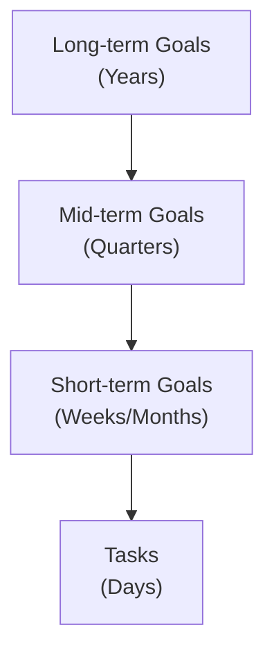
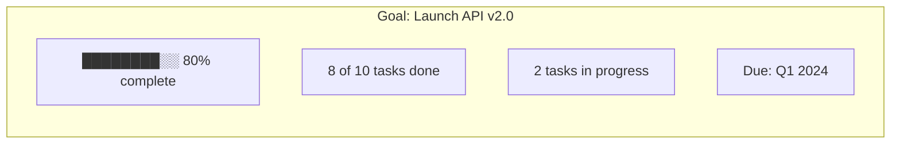
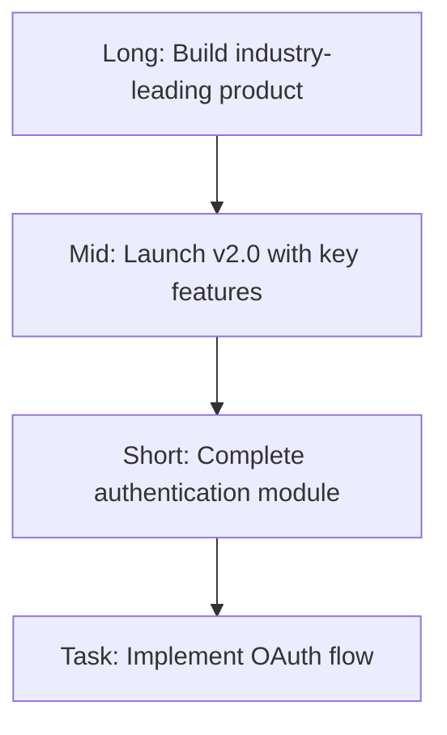

# Goals

Goals in Raven Docs help you align your tasks and documentation with strategic objectives across different time horizons.

## Overview

Goals provide direction for your work:



## Goal Horizons

### Short-term Goals

Goals achievable within weeks to a month:

- Sprint objectives
- Weekly milestones
- Immediate deliverables

**Example:** "Complete user authentication module"

### Mid-term Goals

Goals spanning a quarter (3 months):

- Project milestones
- Feature releases
- Team objectives

**Example:** "Launch v2.0 with new API"

### Long-term Goals

Goals spanning 6 months to years:

- Strategic initiatives
- Vision objectives
- Career or company goals

**Example:** "Become the leading documentation platform for AI teams"

## Creating Goals

### From the UI

1. Navigate to **Goals** in the sidebar
2. Click **New Goal**
3. Fill in:
   - **Title** - Clear, actionable name
   - **Description** - Context and success criteria
   - **Horizon** - Short, mid, or long-term
   - **Keywords** - Tags for organization

### Goal Structure

```typescript
Goal {
  title: "Launch API v2.0"
  description: "Complete redesign of public API with new endpoints"
  horizon: "mid"
  keywords: ["api", "v2", "release"]
  linkedTasks: [task1, task2, ...]
  space: "Engineering"
}
```

## Linking Tasks to Goals

### Manual Linking

When creating or editing a task:

1. Open the task
2. Click **Link to Goal**
3. Select the relevant goal
4. Save

### Automatic Suggestions

The agent can suggest goal links based on:

- Task content and keywords
- Historical patterns
- Related documentation

## Goal Tracking

### Progress View

See goal progress through linked tasks:



### Goal Dashboard

The goals dashboard shows:

- All goals by horizon
- Progress percentages
- Upcoming deadlines
- At-risk goals

## Agent Integration

### Goal-Aware Planning

The agent considers goals when:

- Suggesting task priorities
- Creating daily plans
- Recommending focus areas

### Goal Reviews

During planning sessions, the agent prompts:

- "How does this task align with your goals?"
- "Your mid-term goal X has no recent activity"
- "Consider breaking down goal Y into tasks"

## Best Practices

### Writing Good Goals

**Do:**
- Be specific and measurable
- Include success criteria
- Set realistic timelines
- Link to relevant documentation

**Don't:**
- Be too vague ("Improve things")
- Set too many goals at once
- Forget to review and update

### Goal Hierarchy

Align goals across horizons:



### Regular Reviews

- **Weekly:** Review short-term goals
- **Monthly:** Review mid-term goals
- **Quarterly:** Review long-term goals

## API Access

```typescript
// List goals
const goals = await client.goals.list({
  workspaceId: 'ws_123',
  horizon: 'mid', // optional filter
});

// Create goal
const goal = await client.goals.create({
  workspaceId: 'ws_123',
  spaceId: 'space_456',
  title: 'Launch API v2.0',
  description: 'Complete API redesign',
  horizon: 'mid',
  keywords: ['api', 'release'],
});

// Link task to goal
await client.goals.linkTask({
  workspaceId: 'ws_123',
  goalId: 'goal_789',
  taskId: 'task_abc',
});
```

## Related

- [Tasks](/concepts/tasks) - Task management
- [GTD System](/concepts/gtd) - Productivity workflow
- [Agent Planning](/concepts/agent) - AI-assisted planning
