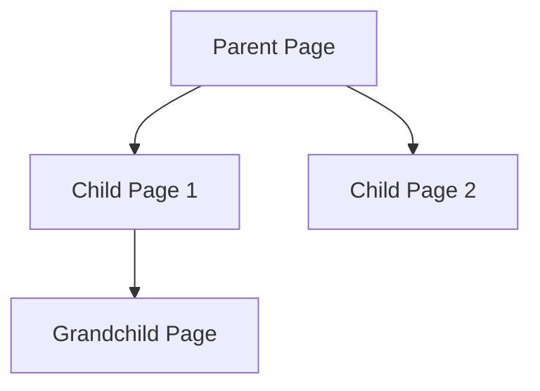

# Pages

Pages are the fundamental unit of content in Raven Docs. They contain your documentation, notes, meeting minutes, and any other text-based content.

## Creating Pages

### From the UI

1. Open a space
2. Click **New Page** or press `Cmd/Ctrl + N`
3. Start typing your content

### From the API

```typescript
const page = await client.pages.create({
  workspaceId: 'ws_123',
  spaceId: 'space_456',
  title: 'My New Page',
  content: {
    type: 'doc',
    content: [
      {
        type: 'paragraph',
        content: [{ type: 'text', text: 'Hello, world!' }],
      },
    ],
  },
});
```

## Page Structure

### Content Format

Pages use a ProseMirror-based document format:

```json
{
  "type": "doc",
  "content": [
    {
      "type": "heading",
      "attrs": { "level": 1 },
      "content": [{ "type": "text", "text": "My Heading" }]
    },
    {
      "type": "paragraph",
      "content": [{ "type": "text", "text": "Some content." }]
    }
  ]
}
```

### Block Types

| Block | Description | Slash Command |
|-------|-------------|---------------|
| Paragraph | Standard text | (default) |
| Heading | H1, H2, H3 | `/h1`, `/h2`, `/h3` |
| Bullet List | Unordered list | `/bullet` |
| Numbered List | Ordered list | `/numbered` |
| Checklist | Todo items | `/checklist` |
| Code Block | Syntax-highlighted code | `/code` |
| Table | Data tables | `/table` |
| Image | Embedded images | `/image` |
| Callout | Info boxes | `/callout` |
| Divider | Horizontal rule | `/divider` |

## Page Hierarchy

Pages can be nested under other pages:



### Moving Pages

Drag and drop pages in the sidebar, or use the API:

```typescript
await client.pages.move({
  pageId: 'page_123',
  workspaceId: 'ws_456',
  parentId: 'page_789', // New parent
});
```

## Page Links

### Internal Links

Link to other pages using double brackets:

```markdown
Check out the [[API Reference]] for more details.
```

Or by page ID:

```markdown
See [[page:page_123|API Reference]].
```

### Backlinks

View all pages that link to the current page in the page info panel.

## Version History

Every page change is tracked:

- View history in the page menu
- Compare versions side-by-side
- Restore previous versions

```typescript
// Get page history
const history = await client.pages.getHistory({
  pageId: 'page_123',
});

// Restore a version
await client.pages.restore({
  historyId: 'hist_456',
});
```

## Typed Pages

Pages can optionally be assigned a **page type** that adds structured metadata and integrates them into the Research Intelligence System.

### Page Types

| Type | Purpose | Key Metadata |
|------|---------|-------------|
| `hypothesis` | A testable claim | `formalStatement`, `predictions`, `status`, `domainTags`, `priority` |
| `experiment` | A test of a hypothesis | `hypothesisId`, `method`, `results`, `status` |
| `finding` | A confirmed result | `source`, `confidence`, `domainTags` |
| `observation` | A raw observation | `context`, `domainTags` |
| `note` | A research note | `domainTags` |

Typed pages are connected in a knowledge graph with edges like `VALIDATES`, `CONTRADICTS`, and `EXTENDS`, enabling evidence chains and automated pattern detection.

[Learn more about Research Intelligence](/guides/research-intelligence)

## Page Metadata

| Field | Description |
|-------|-------------|
| `id` | Unique identifier |
| `title` | Page title |
| `slug` | URL-friendly path |
| `icon` | Emoji or custom icon |
| `pageType` | Optional type (`hypothesis`, `experiment`, `finding`, `observation`, `note`) |
| `metadata` | Structured metadata (varies by page type) |
| `createdAt` | Creation timestamp |
| `updatedAt` | Last modified timestamp |
| `createdBy` | Author user ID |
| `parentId` | Parent page ID (if nested) |

## Collaboration

### Real-time Editing

Multiple users can edit simultaneously:

- Live cursors show who's editing
- Changes merge automatically
- Presence indicators in sidebar

### Comments

Add comments to specific text or the whole page:

```typescript
await client.comments.create({
  pageId: 'page_123',
  workspaceId: 'ws_456',
  text: 'This needs review.',
});
```

## Best Practices

1. **Descriptive titles** - Make pages easy to find
2. **Use headings** - Structure content for scanning
3. **Link liberally** - Connect related content
4. **Keep pages focused** - One topic per page
5. **Regular updates** - Keep content current

## Related

- [Editor Guide](/guides/editor) - Master the editor
- [Organizing Content](/guides/organizing-content) - Structure tips
- [Pages API](/api/endpoints/pages) - API reference
