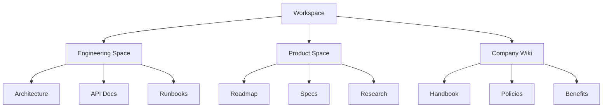
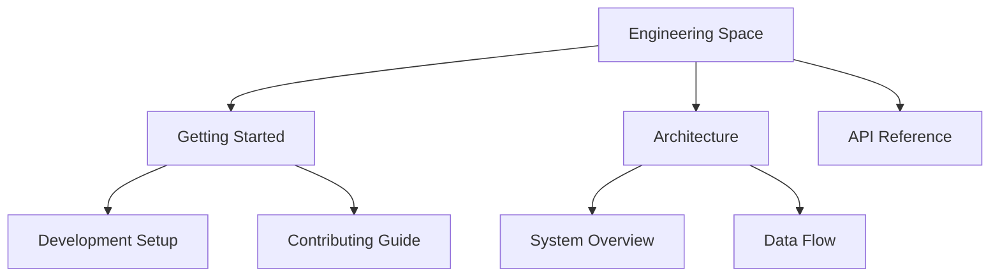

# Spaces

Spaces are containers for organizing related content within a workspace. Think of them as folders or sections for different teams, projects, or topics.

## Overview



## Creating a Space

1. Click **New Space** in the sidebar
2. Enter a name and description
3. Choose default permissions
4. Optionally add members

```typescript
const space = await client.spaces.create({
  workspaceId: 'ws_123',
  name: 'Engineering',
  description: 'Technical documentation and guides',
});
```

## Space Permissions

Each space can have its own permission settings:

| Permission | Description |
|------------|-------------|
| **Public** | All workspace members can view |
| **Private** | Only invited members can access |
| **Custom** | Fine-grained per-user permissions |

### Permission Levels

- **Admin** - Full control over the space
- **Editor** - Create and edit pages
- **Viewer** - Read-only access

## Organizing Content

### Page Hierarchy

Pages within a space can be nested to create a hierarchy:



### Navigation

- **Sidebar** - Shows page tree for the current space
- **Breadcrumbs** - Navigate up the hierarchy
- **Quick search** - Find pages with `Cmd/Ctrl + K`

## Space Settings

### General

- Name and description
- Icon and color
- URL slug

### Members

- Add/remove members
- Set permission levels
- Create groups for bulk access

### Defaults

- Default page template
- Default permissions for new pages

## Best Practices

1. **One space per team or project** - Keep related content together
2. **Clear naming** - Use descriptive names
3. **Consistent structure** - Establish templates
4. **Regular cleanup** - Archive unused content

## API Reference

```typescript
// List spaces in a workspace
const spaces = await client.spaces.list({
  workspaceId: 'ws_123',
});

// Get space details
const space = await client.spaces.get({
  workspaceId: 'ws_123',
  spaceId: 'space_456',
});

// Update space
await client.spaces.update({
  workspaceId: 'ws_123',
  spaceId: 'space_456',
  name: 'Updated Name',
});
```

## Related

- [Pages](/concepts/pages) - Content within spaces
- [Permissions](/guides/permissions) - Access control guide
- [Spaces API](/api/endpoints/spaces) - API reference
