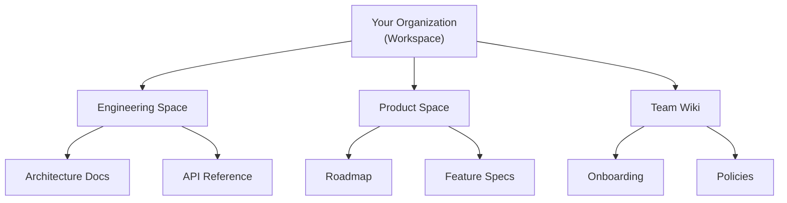

# Getting Started

Get up and running with Raven Docs in under 5 minutes.

## Clone and Run

```bash
# Clone the repository
git clone https://github.com/HaruHunab1320/raven-docs.git
cd raven-docs

# Copy environment file and configure
cp .env.example .env

# Start with Docker Compose
docker compose up -d
```

Once running, open `http://localhost:3000` in your browser and create your first account.

For detailed deployment options, see [Self-Hosting](/self-hosting/overview).

## Create Your First Workspace

A workspace is where your team collaborates. Each workspace has its own members, spaces, and settings.



## Create a Space

Spaces help you organize content by team, project, or topic.

1. Click **New Space** in the sidebar
2. Give it a name and optional description
3. Set permissions (who can view/edit)

## Create Your First Page

1. Open a space
2. Click **New Page** or press `Cmd/Ctrl + N`
3. Start typing!

### Editor Basics

The Raven Docs editor supports:

- **Slash commands**: Type `/` for a command menu
- **Markdown**: Use `#`, `**`, `` ` `` for formatting
- **Drag and drop**: Reorganize content easily
- **AI assistance**: Press `Cmd/Ctrl + J` to invoke AI

```markdown
# Heading 1
## Heading 2

**Bold text** and *italic text*

- Bullet list
- Another item

1. Numbered list
2. Another item

> Blockquote

`inline code`
```

## Invite Your Team

1. Go to **Settings** → **Members**
2. Click **Invite Members**
3. Enter email addresses
4. Choose their role (Admin, Editor, Viewer)

## What's Next?

Now that you're set up, explore these topics:

<div className="quick-links">
  <a href="/concepts/workspaces" className="quick-link">Understand Workspaces</a>
  <a href="/guides/editor" className="quick-link">Master the Editor</a>
  <a href="/guides/task-management" className="quick-link">Track Tasks</a>
  <a href="/api/overview" className="quick-link">Use the API</a>
</div>

## Need Help?

- Check the [Guides](/guides/overview) for detailed walkthroughs
- Join our [Discord](https://discord.gg/jEmMBA2S) for community support
- Open an issue on [GitHub](https://github.com/HaruHunab1320/raven-docs/issues)
