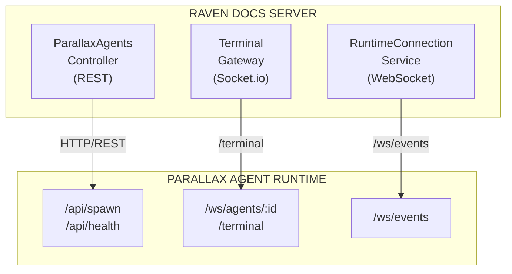
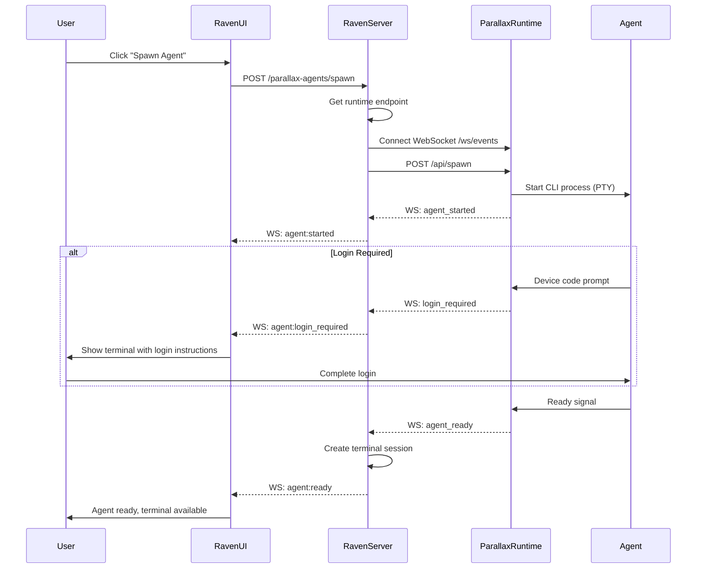
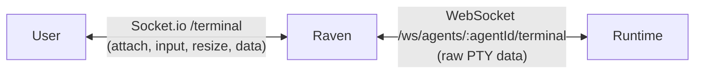
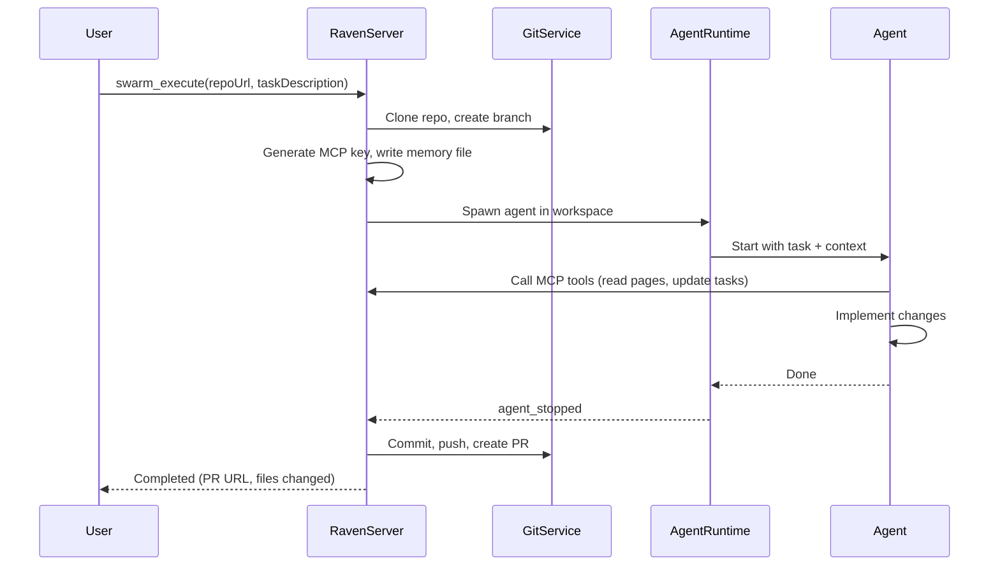
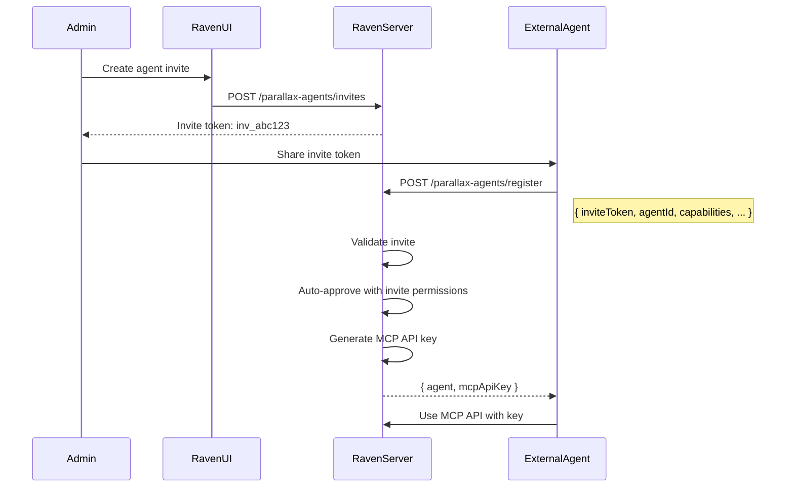

# Agent Runtime Setup

This guide covers how to configure and use agent runtimes with Raven Docs. Agent runtimes allow you to spawn and manage AI coding agents like Claude Code, Codex, Gemini CLI, and Aider.

## Overview

Raven Docs integrates with the Parallax Agent Runtime to spawn and manage interactive CLI agent sessions. The architecture follows a **BYOA (Bring Your Own Agent)** model where:

- **Raven Docs** handles permissions, approvals, audit logs, and the MCP API
- **Parallax Runtime** spawns PTY-backed CLI sessions and handles agent lifecycle
- **Agents** connect to Raven Docs via MCP to access your knowledge base



## Current Status

| Feature | Status | Notes |
|---------|--------|-------|
| Agent Access Requests | Implemented | External agents request workspace access |
| Agent Approval Flow | Implemented | Approve/deny/revoke with permissions |
| Invite Token System (BYOA) | Implemented | Pre-authorized agent registration |
| Agent Spawning | Implemented | Spawn agents via runtime API |
| Terminal/PTY Sessions | Implemented | Proxy and legacy modes |
| Runtime Event Stream | Implemented | WebSocket connection to runtime |
| MCP API Access | Implemented | Agents get MCP API key on approval |
| Activity Logging | Implemented | Full audit trail |
| Agent Assignments | Implemented | Assign agents to projects/tasks |

### Hosting Modes

| Mode | Status | Notes |
|------|--------|-------|
| Local Runtime | Ready | `AGENT_RUNTIME_ENDPOINT` points to local |
| Managed K8s | Planned | Runtime would be Parallax-hosted K8s |
| Customer VPC | Planned | Self-hosted runtime in customer infra |

## Configuration

### Environment Variables

Configure these in your Raven Docs `.env` file:

```bash
# Agent Runtime Endpoint (where to spawn agents)
AGENT_RUNTIME_ENDPOINT=http://localhost:8081

# Parallax Control Plane (for notifications back to Parallax)
PARALLAX_CONTROL_PLANE_URL=http://localhost:3000

# Webhook authentication
PARALLAX_WEBHOOK_SECRET=your-secret-here
```

### Runtime Configuration

The Parallax runtime needs:

```bash
# Callback URL for agent status updates
CALLBACK_URL=https://your-raven-instance.com/api/parallax-agents/spawn-callback

# Workspace ID header verification
# (Runtime validates X-Workspace-Id matches registered workspaces)
```

### Authentication

| Direction | Mechanism |
|-----------|-----------|
| Raven → Runtime | `X-Workspace-Id` header (+ shared secret in future) |
| Runtime → Raven | `X-Webhook-Secret` header (env: `PARALLAX_WEBHOOK_SECRET`) |

## Getting Started

### Developer Setup

```bash
# 1. Start Parallax runtime locally
cd packages/runtime-local
pnpm dev  # Starts on port 8081

# 2. Configure Raven Docs
echo "AGENT_RUNTIME_ENDPOINT=http://localhost:8081" >> .env

# 3. Ensure Claude CLI is installed
claude --version

# 4. Start Raven Docs
pnpm dev
```

### Team/Production Setup

1. Deploy Parallax Runtime (Docker or K8s)
2. Configure mutual authentication:
   - Raven → Runtime: API key or mTLS
   - Runtime → Raven: Webhook secret
3. Set up monitoring: Runtime events → logging/alerting
4. Consider: Managed K8s option when available

## Spawning Agents

### From the UI

1. Go to **Settings → Agents**
2. Click **Spawn Agents**
3. Select agent type (Claude Code, Codex, etc.)
4. Configure count and options
5. Click **Spawn**

### From the API

```bash
curl -X POST http://localhost:3000/api/parallax-agents/spawn \
  -H "Authorization: Bearer YOUR_TOKEN" \
  -H "Content-Type: application/json" \
  -d '{
    "agentType": "claude",
    "count": 1,
    "name": "My Agent",
    "capabilities": ["code_review"],
    "workspaceId": "ws-123"
  }'
```

### Spawn Request Format

Raven sends to Runtime:

```json
{
  "agentType": "claude",
  "count": 1,
  "name": "My Agent",
  "capabilities": ["code_review"],
  "workspaceId": "ws-123",
  "callbackUrl": "https://raven.app/api/parallax-agents/spawn-callback"
}
```

## Agent Lifecycle

### Spawn Flow



### Lifecycle Events

| Event | When | Data |
|-------|------|------|
| `agent:started` | Agent spawning begins | `{ agent: { id, name, type, status } }` |
| `agent:login_required` | CLI needs auth | `{ agent, loginUrl }` |
| `agent:ready` | Agent ready for work | `{ agent, mcpEndpoint, runtimeSessionId }` |
| `agent:stopped` | Agent terminated | `{ agent, reason }` |
| `agent:error` | Spawn/runtime error | `{ agent, error }` |

### WebSocket Event Examples

```typescript
// Listen for agent events
socket.on('agent:started', (data) => {
  console.log(`Agent ${data.agent.id} is starting`);
});

socket.on('agent:login_required', (data) => {
  // Auto-open terminal to show login instructions
  console.log(`Agent ${data.agent.id} needs login: ${data.loginUrl}`);
  showTerminalPanel(data.agent.id);
});

socket.on('agent:ready', (data) => {
  console.log(`Agent ${data.agent.id} is ready`);
  updateAgentStatus(data.agent.id, 'ready');
});

socket.on('agent:stopped', (data) => {
  console.log(`Agent ${data.agent.id} stopped: ${data.reason}`);
});

socket.on('agent:error', (data) => {
  console.error(`Agent ${data.agent.id} error: ${data.error}`);
});
```

## Supported Agent Types

| Type | Description | Auth Required |
|------|-------------|---------------|
| `claude` | Anthropic's Claude Code CLI | Anthropic API key |
| `codex` | OpenAI Codex | OpenAI API key |
| `gemini` | Google Gemini CLI | Google Cloud auth |
| `aider` | Aider pair programming | Provider API key |
| `custom` | Your own agent | Varies |

## Terminal/PTY Integration

Raven Docs provides a web-based terminal to interact with running agents via PTY sessions.

### Connection Flow



### Connecting to a Terminal

```typescript
// User connects via Socket.io
const socket = io('/terminal');

// Attach to an agent's terminal
socket.emit('attach', { agentId: 'agent-456' });

// Handle attachment confirmation
socket.on('attached', (session) => {
  console.log(`Attached to session ${session.sessionId}`);
});

// Receive terminal output
socket.on('data', (output) => {
  xterm.write(output);
});

// Send user input
xterm.onData((input) => {
  socket.emit('input', input);
});

// Handle resize
xterm.onResize(({ cols, rows }) => {
  socket.emit('resize', { cols, rows });
});
```

### Message Formats

**Input (User → Agent):**
```typescript
// Socket.io event
socket.emit('input', 'ls -la\n');

// Forwarded to runtime as raw string
runtimeWs.send('ls -la\n');
```

**Output (Agent → User):**
```typescript
// Runtime sends raw PTY data
runtimeWs.on('message', (data) => {
  // Forward to user preserving escape sequences
  socket.emit('data', data.toString());
});
```

**Resize:**
```typescript
// From user
socket.emit('resize', { cols: 120, rows: 40 });

// To runtime (JSON message)
runtimeWs.send(JSON.stringify({
  type: 'resize',
  cols: 120,
  rows: 40
}));
```

### Terminal States

| Status | Description |
|--------|-------------|
| Pending | Session created, waiting for runtime connection |
| Connecting | Runtime is establishing PTY connection |
| Active | Terminal is ready for interaction |
| Login Required | Agent needs authentication (opens login URL) |
| Disconnected | Runtime connection lost |
| Terminated | Session has ended |

## Coding Swarms

Coding swarms extend the agent runtime to execute coding tasks in isolated git workspaces. Instead of manually spawning agents and directing them, coding swarms handle the full lifecycle automatically.

### How It Works



### Workspace Preparation

Before an agent starts, the system prepares its isolated workspace:

1. **Git workspace** — Clones the target repo and creates a feature branch
2. **MCP API key** — Generates a scoped key so the agent can call back to Raven
3. **Memory file** — Writes `.raven-memory.md` with workspace context, long-term memory, and API documentation
4. **Environment variables** — Sets `MCP_API_KEY`, `MCP_SERVER_URL`, `RAVEN_WORKSPACE_ID`

### Triggering via MCP

```typescript
const { executionId } = await mcp.call("swarm_execute", {
  workspaceId: "ws_123",
  repoUrl: "https://github.com/org/repo",
  taskDescription: "Add rate limiting middleware",
  agentType: "claude-code"  // or codex, gemini, aider
});

// Check progress
const status = await mcp.call("swarm_status", { executionId });
```

### Execution Statuses

| Status | Description |
|--------|-------------|
| `pending` | Execution created, waiting for processing |
| `provisioning` | Cloning repo, creating feature branch |
| `spawning` | Generating credentials, starting agent |
| `running` | Agent is implementing the task |
| `capturing` | Extracting results and changed files |
| `finalizing` | Committing, pushing, creating PR |
| `completed` | Finished successfully |
| `failed` | Error occurred |
| `cancelled` | Stopped by user |

See [Swarm Tools](/mcp/tools/swarm) for the full MCP API reference.

## External Agent Registration (BYOA)

External agents can request access to your workspace using invite tokens.

### Invite Token Flow



### Creating an Invite

1. Go to **Settings → Agents → Invites**
2. Click **Create Invite**
3. Set permissions and expiration
4. Share the token with the external agent

### Registering with an Invite

```bash
curl -X POST http://localhost:3000/api/parallax-agents/register \
  -H "Content-Type: application/json" \
  -d '{
    "inviteToken": "inv_abc123",
    "agentId": "my-external-agent",
    "name": "My External Agent",
    "capabilities": ["code_review", "testing"],
    "avatarUrl": "https://example.com/my-agent-avatar.png"
  }'
```

**Registration Fields:**

| Field | Type | Required | Description |
|-------|------|----------|-------------|
| `inviteToken` | string | Yes | The invite token from workspace admin |
| `agentId` | string | Yes | Unique identifier for your agent |
| `name` | string | Yes | Display name shown in the UI |
| `capabilities` | string[] | No | List of agent capabilities |
| `avatarUrl` | string | No | URL to a custom avatar image |

Response:
```json
{
  "agent": {
    "id": "agent-456",
    "name": "My External Agent",
    "status": "approved",
    "avatarUrl": "https://example.com/my-agent-avatar.png"
  },
  "mcpApiKey": "raven_sk_..."
}
```

:::tip Agent Avatar
Agents can supply their own avatar by including an `avatarUrl` when registering. The avatar will be displayed throughout the workspace UI. If no avatar is provided, a default robot icon is shown.
:::

### Permissions System

Agents are granted specific permissions when approved:

```typescript
const AGENT_PERMISSIONS = {
  // Read operations
  'read:pages': 'Read page content',
  'read:tasks': 'Read task details',
  'read:projects': 'Read project information',
  'read:memory': 'Query workspace memory',

  // Write operations
  'write:pages': 'Create and edit pages',
  'write:tasks': 'Create and update tasks',
  'write:memory': 'Store memories',

  // Advanced operations
  'delete:pages': 'Delete pages',
  'assign:tasks': 'Assign tasks to others',
  'delegate:agents': 'Delegate work to other agents',
};
```

### Access Management Events

```typescript
// External agent requests access
socket.on('agent:access_requested', (data) => {
  // Show notification to admins about pending request
});

// Agent access granted
socket.on('agent:access_approved', (data) => {
  console.log(`Agent ${data.agent.name} approved`);
});

// Agent access revoked
socket.on('agent:access_revoked', (data) => {
  console.log(`Agent ${data.agent.id} revoked: ${data.reason}`);
});
```

## Runtime API Reference

### Endpoints Parallax Runtime Exposes

| Endpoint | Method | Description |
|----------|--------|-------------|
| `/api/health` | GET | Runtime health check |
| `/api/spawn` | POST | Spawn new agents |
| `/api/agents/:id` | GET | Get agent status |
| `/api/agents/:id` | DELETE | Stop agent |
| `/ws/events` | WS | Event stream (agent lifecycle) |
| `/ws/agents/:id/terminal` | WS | PTY terminal connection |

### Endpoints Raven Docs Exposes (Callbacks)

| Endpoint | Method | Description |
|----------|--------|-------------|
| `/api/parallax-agents/spawn-callback` | POST | Agent ready/failed/login_required |
| `/api/parallax-agents/runtime/heartbeat` | POST | Runtime status updates |
| `/api/parallax-agents/access-request` | POST | Agent access request (from Parallax) |

### Callback Payload Example

```json
{
  "workspaceId": "ws-123",
  "agentId": "agent-456",
  "status": "requires_login",
  "loginUrl": "https://claude.ai/oauth/device?code=ABC123",
  "runtimeSessionId": "session-789"
}
```

## Troubleshooting

### "Runtime endpoint not configured"

Set `AGENT_RUNTIME_ENDPOINT` in your `.env` file.

### "Connection failed"

1. Verify the runtime is running: `curl http://localhost:8081/api/health`
2. Check firewall rules allow the connection
3. Verify the endpoint URL is correct (include protocol)

### "Authentication failed"

1. Verify `PARALLAX_WEBHOOK_SECRET` matches between Raven Docs and runtime
2. Check runtime logs for auth errors

### "Agent spawn failed"

1. Check runtime logs for detailed error
2. Verify the agent type is supported
3. Ensure required API keys are configured (e.g., Anthropic key for Claude)
4. Check available system resources (memory, disk)

### "Login required but no URL shown"

1. Check that WebSocket connection is active
2. Verify the callback URL is reachable from runtime
3. Check browser console for errors

## Security Considerations

### Network Security

- Use HTTPS for production runtime endpoints
- Restrict runtime endpoint to known IPs if possible
- Configure `PARALLAX_WEBHOOK_SECRET` in production

### API Key Storage

- Runtime API keys are stored encrypted in workspace settings
- Agent API keys (Anthropic, OpenAI) should be configured at runtime level
- Never commit API keys to version control

### Agent Isolation

- Each spawned agent runs in isolated PTY session
- Agents only have access to resources granted via MCP permissions
- Use the permissions system to limit agent capabilities

## Summary

| Component | Protocol | Purpose |
|-----------|----------|---------|
| `/api/parallax-agents/*` | REST | Agent CRUD, permissions, assignments |
| `/terminal` | Socket.io | User ↔ terminal interaction |
| Runtime `/ws/events` | WebSocket | Agent lifecycle events |
| Runtime `/ws/agents/:id/terminal` | WebSocket | PTY data stream |
| Runtime `/api/spawn` | REST | Spawn new agents |
| Callback `/spawn-callback` | REST | Agent status notifications |

## Next Steps

- [Agent Permissions](/concepts/agent#agent-permissions) - Configure what agents can access
- [MCP Tools](/mcp/tools/agent) - API reference for agent operations
- [Agent Invites](/concepts/agent#creating-agent-invites) - Allow external agents to register
