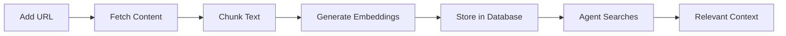

# Knowledge Base

The knowledge base allows you to upload documentation and reference material that agents can use to answer questions. This powers RAG (Retrieval-Augmented Generation) so agents have access to your organization's specific information.

## How It Works

When you add a knowledge source:

1. **Content is fetched** - URLs are crawled, files are parsed
2. **Text is chunked** - Content is split into searchable segments (~500-1000 tokens)
3. **Chunks are embedded** - Each chunk gets a vector embedding for semantic search
4. **Agents can search** - When users ask questions, agents find relevant chunks

## Knowledge Scopes

Knowledge sources can be scoped at different levels:

| Scope | Available To | Use Case |
|-------|-------------|----------|
| **System** | All workspaces | Raven Docs help documentation |
| **Workspace** | All spaces in workspace | Company policies, shared docs |
| **Space** | Only that space | Team-specific documentation |

### Inheritance

- Agents in a space can access: **Space** + **Workspace** + **System** knowledge
- More specific scopes take priority in search results

## Adding Knowledge Sources

### Workspace-Level Knowledge

For documentation available across all spaces:

1. Go to **Settings** → **General** → **Knowledge**
2. Click **Add Knowledge Source**
3. Enter a name and URL
4. Click **Add Source**

The source will show as "Processing" while being indexed, then "Ready" when available.

### Space-Level Knowledge

For team or project-specific documentation:

1. Open the space settings (gear icon)
2. Go to the **Knowledge** tab
3. Click **Add Knowledge Source**
4. Enter a name and URL
5. Click **Add Source**

## Source Types

| Type | Description | Status |
|------|-------------|--------|
| **URL** | Web page that gets fetched and indexed | Available |
| **File** | Uploaded document (PDF, DOCX, MD, TXT) | Coming soon |
| **Page** | Internal Raven Docs page | Coming soon |

## Source Status

| Status | Meaning |
|--------|---------|
| **Pending** | Queued for processing |
| **Processing** | Currently being chunked and embedded |
| **Ready** | Available for agent searches |
| **Error** | Processing failed (check error message) |

## Managing Sources

### Refresh a Source

To re-fetch and re-index a URL source:

1. Find the source in the knowledge list
2. Click the menu (three dots)
3. Select **Refresh**

This is useful when the source content has changed.

### Delete a Source

1. Find the source in the knowledge list
2. Click the menu (three dots)
3. Select **Delete**

All indexed chunks will be removed.

## Best Practices

1. **Use specific, focused sources** - Smaller, targeted documents work better than large general ones
2. **Keep URLs up to date** - Refresh sources when content changes
3. **Scope appropriately** - Put shared docs at workspace level, team docs at space level
4. **Check processing status** - Ensure sources are "Ready" before expecting agents to use them
5. **Review error messages** - If processing fails, check if the URL is accessible

## How Agents Use Knowledge

When a user asks a question:

1. The query is converted to a vector embedding
2. Similar chunks are found using semantic search
3. Top matching chunks are included in the agent's context
4. The agent uses this context to answer the question

This means agents can answer questions about your specific documentation without needing to be trained on it.

## Example Use Cases

### Company Documentation
Add your company wiki, policies, and procedures at the workspace level so all teams can ask questions about them.

### API Documentation
Add your API docs so developers can ask the agent "How do I authenticate?" or "What's the endpoint for creating users?"

### Project Documentation
Add project-specific docs at the space level so the team can ask "What's our deployment process?" or "How do we handle errors?"

## Related

- [Memory System](/guides/memory) - User-generated context
- [Knowledge Tools (MCP)](/mcp/tools/knowledge) - API access for agents
- [Agent Overview](/concepts/agent) - How agents work
