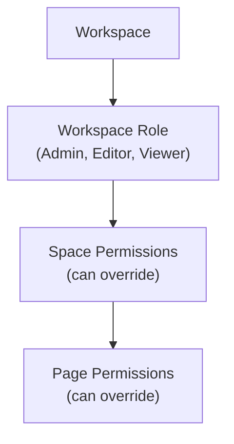
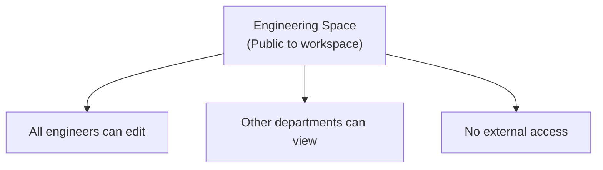
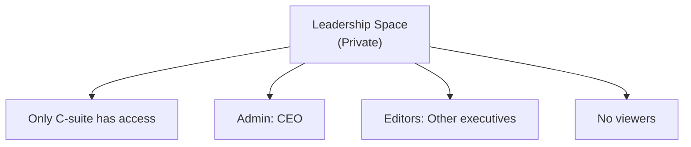
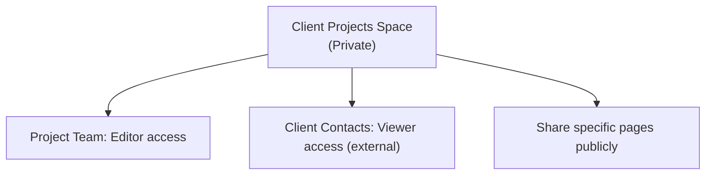
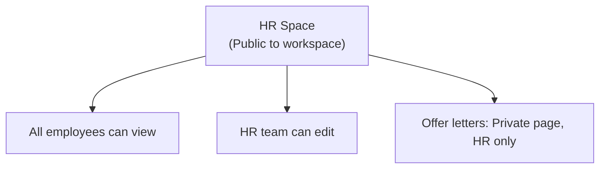

# Permissions

Raven Docs uses a hierarchical permission model to control access to your content.

## Permission Hierarchy



Permissions cascade down but can be overridden at each level.

## Workspace Roles

| Role | Description |
|------|-------------|
| **Owner** | Full control, can delete workspace |
| **Admin** | Manage members, settings, all content |
| **Editor** | Create/edit content, cannot change settings |
| **Viewer** | Read-only access to permitted content |

### Assigning Workspace Roles

1. Go to **Settings** → **Members**
2. Click on a member
3. Select their role
4. Save changes

```typescript
await client.workspaces.changeMemberRole({
  workspaceId: 'ws_123',
  userId: 'user_456',
  role: 'editor',
});
```

## Space Permissions

Spaces can have their own permission settings:

### Visibility

| Setting | Description |
|---------|-------------|
| **Public** | All workspace members can access |
| **Private** | Only explicitly added members |

### Space Roles

| Role | Permissions |
|------|-------------|
| **Admin** | Full control of space, manage members |
| **Editor** | Create/edit pages in this space |
| **Viewer** | Read-only access to this space |

### Setting Space Permissions

```typescript
// Make space private
await client.spaces.update({
  workspaceId: 'ws_123',
  spaceId: 'space_456',
  visibility: 'private',
});

// Add member to space
await client.spaces.addMember({
  workspaceId: 'ws_123',
  spaceId: 'space_456',
  userId: 'user_789',
  role: 'editor',
});
```

## Page Permissions

Individual pages can override space permissions:

### Permission Levels

- **Inherit** - Use space permissions (default)
- **Custom** - Set specific permissions for this page

### Use Cases

- Private page in a public space
- Shared page in a private space
- Different access levels for specific users

```typescript
await client.pages.setPermissions({
  pageId: 'page_123',
  workspaceId: 'ws_456',
  permissions: [
    { userId: 'user_111', role: 'editor' },
    { userId: 'user_222', role: 'viewer' },
  ],
});
```

## Groups

Create groups to manage permissions at scale:

### Creating Groups

1. Go to **Settings** → **Groups**
2. Click **Create Group**
3. Name the group (e.g., "Engineering Team")
4. Add members

```typescript
const group = await client.groups.create({
  workspaceId: 'ws_123',
  name: 'Engineering Team',
});

await client.groups.addMember({
  workspaceId: 'ws_123',
  groupId: 'group_456',
  userId: 'user_789',
});
```

### Assigning Group Permissions

Apply permissions to entire groups:

```typescript
await client.spaces.updatePermissions({
  workspaceId: 'ws_123',
  spaceId: 'space_456',
  targetId: 'group_789',
  role: 'editor',
  isGroup: true,
});
```

## External Sharing

Share content with people outside your workspace:

### Public Links

1. Click **Share** on any page
2. Enable **Public Link**
3. Configure options:
   - Password protection
   - Expiration date
   - Download permissions
4. Copy and share the link

### Guest Access

For frequent external collaborators:

1. Invite as guest (limited access)
2. Grant access to specific spaces
3. Guests see limited UI

## Security Best Practices

### Principle of Least Privilege

- Start with viewer access
- Upgrade to editor only when needed
- Reserve admin for those who need it

### Regular Audits

Schedule periodic permission reviews:

1. **Monthly**: Review new members' access
2. **Quarterly**: Audit space permissions
3. **Annually**: Full access review

### Sensitive Content

For highly sensitive information:

1. Create a private space
2. Limit membership explicitly
3. Disable external sharing
4. Enable audit logging (Enterprise)

## Permission Scenarios

### Scenario 1: Department Wiki



### Scenario 2: Executive Documents



### Scenario 3: Client Documentation



### Scenario 4: Onboarding



## API Reference

```typescript
// Get space members
const members = await client.spaces.members({
  workspaceId: 'ws_123',
  spaceId: 'space_456',
});

// Update permissions
await client.spaces.updatePermissions({
  workspaceId: 'ws_123',
  spaceId: 'space_456',
  targetId: 'user_789',
  role: 'editor',
});

// Remove member
await client.spaces.removeMember({
  workspaceId: 'ws_123',
  spaceId: 'space_456',
  userId: 'user_789',
});
```

## Related

- [Workspaces Concept](/concepts/workspaces) - Workspace overview
- [Collaboration](/concepts/collaboration) - Sharing and teamwork
- [Users API](/api/endpoints/users) - User management API
