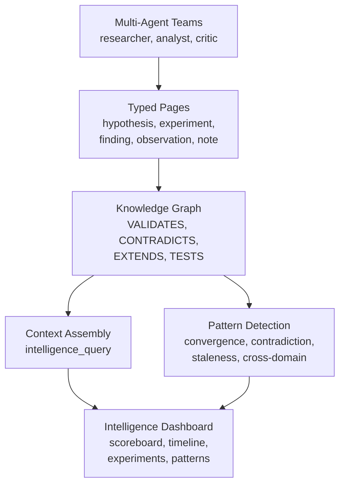
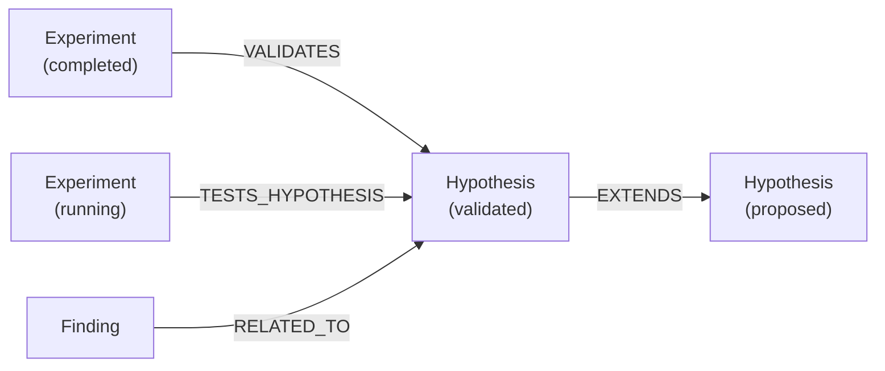

# Research Intelligence

The Research Intelligence System transforms Raven Docs from a documentation tool into a structured knowledge engine. It introduces typed pages, a knowledge graph, multi-agent teams, automated pattern detection, and an intelligence dashboard.

## Overview



## Typed Pages

Pages can be assigned a **page type** that adds structured metadata and integrates them into the research graph.

### Page Types

| Type | Purpose | Key Metadata |
|------|---------|-------------|
| `hypothesis` | A testable claim | `formalStatement`, `predictions`, `status`, `domainTags`, `priority` |
| `experiment` | A test of a hypothesis | `hypothesisId`, `method`, `results`, `status` |
| `finding` | A confirmed result | `source`, `confidence`, `domainTags` |
| `observation` | A raw observation | `context`, `domainTags` |
| `note` | A research note | `domainTags` |

### Hypothesis Statuses

| Status | Meaning |
|--------|---------|
| `proposed` | Stated but not yet tested |
| `testing` | Experiments are underway |
| `validated` | Evidence supports the claim |
| `refuted` | Evidence contradicts the claim |
| `inconclusive` | Mixed or insufficient results |

### Creating Typed Pages

Use the MCP tools to create typed pages:

```typescript
// Create a hypothesis
await mcp.call("hypothesis_create", {
  workspaceId: "ws_123",
  spaceId: "space_456",
  title: "Redis caching reduces API latency by 50%",
  formalStatement: "Adding Redis caching to /api/search will reduce p95 latency from 800ms to under 400ms",
  predictions: ["Cache hit rate > 80%", "Memory stays under 512MB"],
  domainTags: ["performance", "infrastructure"],
  priority: "high"
});

// Register an experiment
await mcp.call("experiment_register", {
  workspaceId: "ws_123",
  spaceId: "space_456",
  title: "Redis cache load test",
  hypothesisId: "page_hyp_123",
  method: "1000 concurrent users against /api/search"
});
```

## Knowledge Graph

Typed pages are connected by directed edges in a knowledge graph powered by Memgraph:



### Edge Types

| Edge | Description |
|------|-------------|
| `VALIDATES` | Experiment confirms a hypothesis |
| `CONTRADICTS` | Evidence contradicts a claim |
| `TESTS_HYPOTHESIS` | Experiment is testing a hypothesis |
| `EXTENDS` | One hypothesis builds on another |
| `REFINES` | A more specific version of a finding |
| `DEPENDS_ON` | Logical dependency between claims |
| `RELATED_TO` | General association |

### Evidence Chains

When you retrieve a hypothesis, the system traverses the graph to build an **evidence chain** showing all supporting, contradicting, and related evidence:

```typescript
const result = await mcp.call("hypothesis_get", {
  workspaceId: "ws_123",
  pageId: "page_hyp_123"
});

// result.evidenceChain.supporting → experiments that VALIDATE
// result.evidenceChain.contradicting → experiments that CONTRADICT
// result.evidenceChain.related → pages connected by EXTENDS, RELATED_TO, etc.
```

## Intelligence Queries

The context assembly system answers natural-language questions like "What do we know about X?" by combining data from typed pages, the knowledge graph, and pattern detections:

```typescript
const context = await mcp.call("intelligence_query", {
  workspaceId: "ws_123",
  query: "What do we know about caching performance?"
});

// Returns: hypotheses, experiments, related pages,
// graph edges, detected patterns, and open questions
```

This is especially useful for giving AI agents full research context before they take action.

## Multi-Agent Teams

Deploy teams of specialized AI agents from templates:

```typescript
// Deploy a hypothesis-testing team
const team = await mcp.call("team_deploy", {
  workspaceId: "ws_123",
  spaceId: "space_456",
  templateName: "hypothesis-testing"
});
```

### Templates

| Template | Agents | Purpose |
|----------|--------|---------|
| `hypothesis-testing` | Researcher, Analyst, Critic | Test and validate hypotheses |
| `literature-review` | Surveyor, Synthesizer, Reviewer | Literature analysis |
| `exploration` | Explorer, Mapper, Reporter | Open-ended exploration |

Teams run on a schedule or can be triggered manually. Each agent has a defined role, tools, and system prompt.

## Pattern Detection

The pattern detection engine automatically scans the research graph every 6 hours to surface insights:

| Pattern | What it detects | Severity |
|---------|----------------|----------|
| **Convergence** | 3+ experiments validate the same hypothesis | Medium |
| **Contradiction** | CONTRADICTS edges between pages | High |
| **Staleness** | Open questions not updated in 14+ days | Low |
| **Cross-domain** | Unexpected connections across domain tags | Medium |
| **Untested implication** | Validated hypothesis EXTENDS an untested one | Medium |

### Managing Patterns

```typescript
// List detected patterns
const patterns = await mcp.call("pattern_list", {
  workspaceId: "ws_123",
  status: "detected"
});

// Acknowledge a pattern
await mcp.call("pattern_acknowledge", {
  patternId: "pat_001",
  actionTaken: { notes: "Created experiment to resolve" }
});

// Trigger detection manually
await mcp.call("pattern_run", {
  workspaceId: "ws_123"
});
```

### Configuration

Pattern detection is configured in workspace intelligence settings:

```json
{
  "intelligence": {
    "enabled": true,
    "patternRules": [
      { "type": "convergence", "enabled": true, "threshold": 3, "action": "surface" },
      { "type": "contradiction", "enabled": true, "action": "notify" },
      { "type": "staleness", "enabled": true, "maxAgeDays": 14, "action": "create_task" }
    ]
  }
}
```

## Intelligence Dashboard

The Intelligence Dashboard (accessible at `/spaces/:spaceId/intelligence`) provides a visual overview:

- **Hypothesis Scoreboard** — Counts of validated, testing, refuted, and proposed hypotheses
- **Active Experiments** — List of running and planned experiments with status badges
- **Open Questions** — Filterable queue of unresolved research questions
- **Recent Findings Timeline** — Activity feed of typed page updates
- **Contradiction Alerts** — Pairs of contradicting pages
- **Pattern Alerts** — Detected patterns with acknowledge/dismiss actions

## Enabling Intelligence

To enable the Research Intelligence System for a workspace:

1. Ensure Memgraph is available (for the knowledge graph)
2. Enable intelligence in workspace settings
3. Configure pattern rules as desired
4. Start creating typed pages via MCP tools

## MCP Tools Reference

| Tool | Purpose |
|------|---------|
| [hypothesis_create/update/get](/mcp/tools/hypothesis) | Manage hypotheses |
| [experiment_register/complete/update](/mcp/tools/experiment) | Manage experiments |
| [intelligence_query](/mcp/tools/intelligence) | Query assembled context |
| [relationship_create/remove/list](/mcp/tools/relationship) | Manage graph edges |
| [team_deploy/status/list/trigger/pause/resume/teardown](/mcp/tools/team) | Multi-agent teams |
| [pattern_list/acknowledge/dismiss/run](/mcp/tools/pattern) | Pattern detection |

## Related

- [Research Tools](/mcp/tools/research) - AI-powered research jobs
- [Agent Tools](/mcp/tools/agent) - Agent management
- [Pages Concept](/concepts/pages) - Page basics including typed pages
