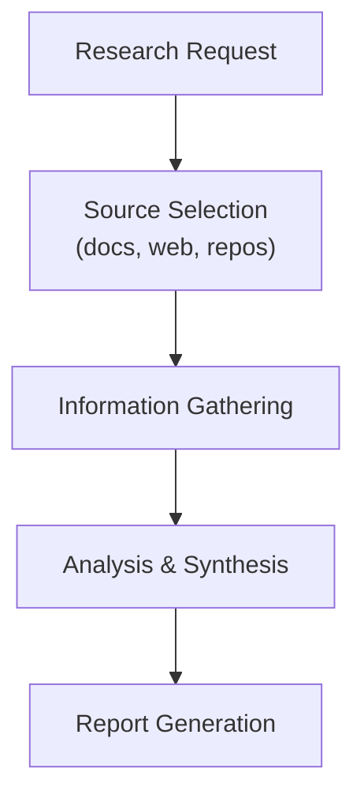
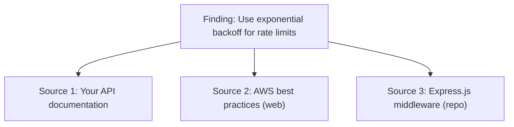

# Research

The research feature allows the AI agent to conduct in-depth research from multiple sources and generate comprehensive reports.

## Overview

Research jobs gather information and synthesize findings:



## Creating Research Jobs

### From Chat

Ask the agent to research:

```
You: Research best practices for API rate limiting

Agent: I'll research API rate limiting best practices.
       Sources: Documentation, Web
       Estimated time: 5-10 minutes

       [Starting research...]
```

### Research Configuration

When creating research, specify:

| Option | Description | Default |
|--------|-------------|---------|
| **Topic** | What to research | Required |
| **Sources** | Where to look | Docs + Web |
| **Time Budget** | Max research time | 60 minutes |
| **Output Mode** | Report format | Longform |
| **Target Space** | Where to save report | Current |

## Research Sources

### Documentation

Search your workspace documentation:

- All accessible pages
- Linked attachments
- Page history
- Comments and discussions

### Web

Search the public internet:

- Technical documentation
- Blog posts and articles
- Stack Overflow
- Official guides

### Repositories

Analyze GitHub repositories:

```typescript
Research Config {
  sources: ['repository'],
  repository: {
    url: 'https://github.com/org/repo',
    paths: ['src/', 'docs/'],  // optional filter
    branch: 'main',
  }
}
```

Repository research can analyze:

- Code structure
- README and documentation
- Implementation patterns
- Dependencies

## Output Modes

### Longform

Comprehensive report with:

- Executive summary
- Detailed findings
- Code examples
- References
- Recommendations

Best for: Deep dives, documentation, decision support

### Brief

Concise summary with:

- Key points
- Quick recommendations
- Essential links

Best for: Quick answers, status updates, overviews

## Research Workflow

### 1. Request

Clearly state what you need:

```
Good: "Research authentication patterns for Node.js APIs,
       focusing on JWT vs session-based auth"

Too vague: "Research authentication"
```

### 2. Source Selection

Choose appropriate sources:

| Need | Recommended Sources |
|------|---------------------|
| Internal knowledge | Docs only |
| Industry practices | Web |
| Code patterns | Repository + Web |
| Comprehensive | All sources |

### 3. Time Budget

Set realistic time budgets:

| Research Type | Suggested Time |
|---------------|----------------|
| Quick lookup | 5 minutes |
| Topic overview | 15-30 minutes |
| Deep dive | 60+ minutes |
| Comprehensive | 120+ minutes |

### 4. Review Results

Research generates a report page:

```markdown
# Research: API Rate Limiting Best Practices

## Summary
[Executive summary of findings]

## Key Findings

### 1. Token Bucket Algorithm
[Details and examples]

### 2. Sliding Window
[Details and examples]

## Recommendations
[Actionable recommendations]

## Sources
[List of sources consulted]

---
Generated: 2024-01-15
Time spent: 45 minutes
Sources: 12 documents, 8 web pages
```

## Managing Research Jobs

### View Active Research

See ongoing research:

1. Open **Agent Chat**
2. Click **Active Jobs**
3. View progress and status

### Research History

Access past research:

1. Navigate to the target space
2. Look for research report pages
3. Or search "Research:" in your workspace

### Cancel Research

Stop ongoing research:

```
You: Cancel the current research

Agent: Research job cancelled. Partial results saved.
```

## Advanced Features

### Multi-Source Synthesis

The agent combines information from multiple sources:



### Follow-up Research

Dive deeper into findings:

```
You: Tell me more about the token bucket algorithm
     mentioned in the research

Agent: [Provides detailed explanation or starts
       focused follow-up research]
```

### Research Templates

Create templates for common research:

```typescript
Research Template: "Competitive Analysis" {
  sources: ['web'],
  outputMode: 'longform',
  timeBudget: 90,
  structure: [
    'Market Overview',
    'Key Players',
    'Feature Comparison',
    'Recommendations',
  ]
}
```

## API Access

### Create Research Job

```typescript
const job = await client.research.create({
  workspaceId: 'ws_123',
  topic: 'API rate limiting best practices',
  sources: ['docs', 'web'],
  outputMode: 'longform',
  timeBudget: 60,
  targetSpaceId: 'space_456',
});
```

### Check Status

```typescript
const status = await client.research.status({
  workspaceId: 'ws_123',
  jobId: job.id,
});

// status: 'pending' | 'running' | 'completed' | 'failed'
```

### Get Results

```typescript
const report = await client.research.getReport({
  workspaceId: 'ws_123',
  jobId: job.id,
});
```

## Best Practices

1. **Be specific** - Clear topics yield better results
2. **Choose sources wisely** - Match sources to the question
3. **Set time budgets** - Balance depth with urgency
4. **Review and refine** - Use findings to ask follow-ups
5. **Save valuable research** - Link reports to relevant projects

## Limitations

- Web research respects robots.txt
- Repository analysis requires public access or auth
- Time budgets are approximate
- Very large repositories may be partially analyzed

## Related

- [AI Agent](/concepts/agent) - Agent capabilities
- [Memory System](/guides/memory) - Research stored in memory
- [MCP Research Tools](/mcp/tools/research) - API access
