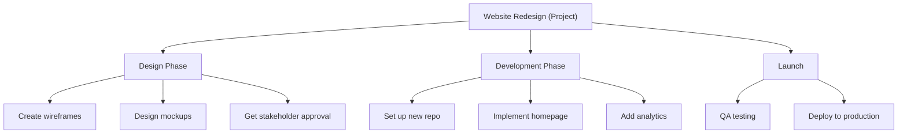
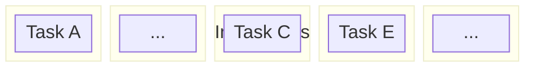

# Task Management

Raven Docs integrates task management directly with your documentation, keeping work items in context.

## Task Basics

### Creating Tasks

**From a page:**
1. Type `/task` in the editor
2. Fill in the task details
3. Task links automatically to the page

**From Tasks view:**
1. Click **Tasks** in sidebar
2. Click **+ New Task**
3. Optionally link to a page

**Keyboard shortcut:**
`Cmd/Ctrl + Shift + T` creates a task from selected text

### Task Properties

| Property | Description | Required |
|----------|-------------|----------|
| Title | Short description | Yes |
| Description | Details (markdown) | No |
| Assignee | Who's responsible | No |
| Due Date | Deadline | No |
| Priority | High / Medium / Low | No |
| Status | Todo / In Progress / Done | Yes |
| Project | Parent project | No |
| Labels | Custom tags | No |

## Projects

Group related tasks into projects:

### Creating a Project

```typescript
const project = await client.projects.create({
  workspaceId: 'ws_123',
  spaceId: 'space_456',
  name: 'Website Redesign',
  description: 'Q1 website refresh project',
});
```

### Project Structure



## Workflows

### Daily Standup

1. Open **My Tasks** view
2. Review tasks due today
3. Update status as you work
4. Use triage buckets for quick sorting

### Weekly Planning

1. Review **All Tasks** with "No Due Date" filter
2. Prioritize and assign due dates
3. Move tasks to appropriate projects
4. Archive completed projects

### Sprint Planning

1. Create project for the sprint
2. Add tasks from backlog
3. Assign to team members
4. Set due dates based on sprint end

## Views

### List View

Traditional task list with:
- Sort by any field
- Filter by status, assignee, project
- Bulk select and update
- Inline editing

### Board View

Kanban columns for visual workflow:



Customize columns based on your workflow.

### Calendar View

Tasks displayed by due date:
- Drag to reschedule
- See workload distribution
- Identify deadline conflicts

### My Tasks

Personal dashboard showing:
- Tasks assigned to you
- Tasks you created
- Overdue tasks highlighted
- Quick filters

## Triage Buckets

Quickly categorize tasks without full details:

| Bucket | Purpose |
|--------|---------|
| **Now** | Do today |
| **Next** | Do this week |
| **Later** | Backlog |
| **None** | Unsorted |

### Triage Workflow

1. New tasks go to "None"
2. Daily: Review "None" bucket
3. Move tasks to Now/Next/Later
4. Process "Now" tasks each day

## Task Mentions

Reference tasks in documentation:

```markdown
Before launching, complete @task[Final QA Review].

See @task[Design Mockups] for the latest designs.
```

This creates bidirectional links:
- Document shows the task
- Task shows which documents mention it

## Notifications

Get notified when:
- Assigned a task
- Task you're watching is updated
- Due date approaching
- Task is mentioned

Configure in **Settings** → **Notifications**.

## Integrations

### Slack Integration

- Create tasks from Slack with `/raven task`
- Get task notifications in channels
- Update tasks from Slack

### GitHub Integration

- Link tasks to PRs and issues
- Auto-update status when PR merges
- See code activity on tasks

## Best Practices

### Creating Good Tasks

**Good task:**
> "Add rate limiting to /api/users endpoint - max 100 req/min"

**Poor task:**
> "Fix API"

Include:
- Specific action verb
- Clear scope
- Acceptance criteria when needed

### Task Hygiene

1. **Review weekly** - Close completed tasks
2. **Break down large tasks** - Keep tasks small
3. **Use projects** - Group related work
4. **Assign owners** - Every task needs someone responsible
5. **Set realistic due dates** - Don't over-commit

### Team Conventions

Establish team agreements:
- When to create tasks vs. just do it
- Required fields (e.g., always set priority)
- Review/approval workflows
- Archive policy

## API Reference

```typescript
// List tasks
const tasks = await client.tasks.list({
  workspaceId: 'ws_123',
  status: 'todo',
  assigneeId: 'user_456',
});

// Create task
const task = await client.tasks.create({
  workspaceId: 'ws_123',
  title: 'Review documentation',
  assigneeId: 'user_456',
  dueDate: '2025-02-01',
  priority: 'high',
});

// Update task
await client.tasks.update({
  taskId: 'task_123',
  workspaceId: 'ws_456',
  status: 'in_progress',
});
```

## Related

- [Tasks Concept](/concepts/tasks) - Core concepts
- [Tasks API](/api/endpoints/tasks) - API reference
