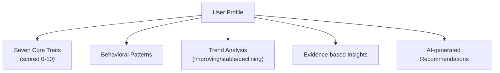

# User Profiles & Behavioral Insights

Raven Docs includes a sophisticated behavioral analysis system that builds personalized user profiles based on activity patterns. Rather than simple XP or levels, the system evaluates users across seven core behavioral traits.

## Overview

The profile system analyzes your activity signals to create a comprehensive behavioral profile:



## The Seven Traits

Your profile is evaluated across seven behavioral dimensions:

### Focus

Ability to maintain concentrated attention on tasks and resist distractions.

**Behavioral Indicators:**
- Deep work sessions (>30 minutes on single tasks)
- Single-project focus over task-switching
- Minimal context-switching between unrelated items
- Sustained engagement with content

**Score Guide:**
| Score | Description |
|-------|-------------|
| 9-10 | Exceptional focus, extended deep work sessions |
| 7-8 | Strong focus with occasional distractions |
| 5-6 | Moderate focus, some task-switching |
| 3-4 | Difficulty maintaining attention |
| 0-2 | Frequent context-switching |

### Execution

Ability to complete tasks and deliver results.

**Behavioral Indicators:**
- High task completion rate (>80%)
- Meeting deadlines consistently
- Following through on commitments
- Translating plans into action

**Score Guide:**
| Score | Description |
|-------|-------------|
| 9-10 | Excellent completion rate, consistently delivers |
| 7-8 | Strong execution with minor gaps |
| 5-6 | Moderate completion, some overdue tasks |
| 3-4 | Struggles with completion |
| 0-2 | Many incomplete or overdue tasks |

### Creativity

Ability to generate novel ideas and approach problems innovatively.

**Behavioral Indicators:**
- Creating original content
- Making cross-domain connections
- Using creative tools (diagrams, brainstorming)
- Diverse content types

**Score Guide:**
| Score | Description |
|-------|-------------|
| 9-10 | Highly innovative, original approaches |
| 7-8 | Creative with consistent new ideas |
| 5-6 | Some creative output |
| 3-4 | Mostly follows established patterns |
| 0-2 | Limited creative activity |

### Communication

Ability to express ideas clearly and collaborate effectively.

**Behavioral Indicators:**
- Clear documentation practices
- Active in comments and discussions
- Providing constructive feedback
- Collaborative editing

**Score Guide:**
| Score | Description |
|-------|-------------|
| 9-10 | Excellent communicator, highly collaborative |
| 7-8 | Strong communication skills |
| 5-6 | Adequate documentation and collaboration |
| 3-4 | Minimal communication |
| 0-2 | Limited collaborative activity |

### Leadership

Ability to guide initiatives and make decisions.

**Behavioral Indicators:**
- Initiating new projects
- Setting priorities and direction
- Documenting decisions
- Guiding team activities

**Score Guide:**
| Score | Description |
|-------|-------------|
| 9-10 | Strong leader, initiates and guides effectively |
| 7-8 | Takes initiative regularly |
| 5-6 | Occasional leadership activity |
| 3-4 | Follows more than leads |
| 0-2 | Minimal initiative |

### Learning

Ability to acquire knowledge and develop skills.

**Behavioral Indicators:**
- Exploring new topics
- Using research features
- Applying newly learned information
- Expanding knowledge areas

**Score Guide:**
| Score | Description |
|-------|-------------|
| 9-10 | Constant learner, rapid skill development |
| 7-8 | Active learning and growth |
| 5-6 | Moderate learning activity |
| 3-4 | Limited exploration |
| 0-2 | Minimal learning engagement |

### Resilience

Ability to persist through challenges and maintain momentum.

**Behavioral Indicators:**
- Continuing despite obstacles
- Re-engaging after gaps
- Iterating on work
- Long-term persistence on goals

**Score Guide:**
| Score | Description |
|-------|-------------|
| 9-10 | Exceptional persistence, overcomes all obstacles |
| 7-8 | Strong resilience with sustained effort |
| 5-6 | Moderate persistence |
| 3-4 | Gives up when facing challenges |
| 0-2 | Limited persistence |

## How Scoring Works

### Signal-to-Trait Mapping

Your activities generate signals that contribute to trait scores:

| Activity | Primary Traits | Weight |
|----------|---------------|--------|
| Create project | Leadership, Creativity | High |
| Update project | Execution, Focus | Medium |
| Create page | Creativity, Execution | Medium |
| Add comment | Communication, Leadership | Medium |
| Agent chat | Learning, Creativity | Low |
| Research job | Learning, Focus, Creativity | High |
| Complete task | Execution, Resilience | High |

### Behavioral Patterns

Four additional patterns influence your scores:

**Completion Rate**
```
completed_projects / total_projects
```
Boosts: Execution

**Consistency Score**
```
unique_active_days / date_range
```
Boosts: Focus, Resilience

**Diversity Score**
```
variety_of_activities / max_possible
```
Boosts: Creativity

**Collaboration Score**
```
communication_signals / total_signals
```
Boosts: Communication

### Normalization

Raw scores are normalized using a logarithmic scale to prevent gaming:

```
normalized = (log(1 + raw) / log(1 + max_expected)) × 10
```

This provides diminishing returns for high activity volumes.

## Profile Distillation

### Requirements

For a full profile to be generated, you need:

| Requirement | Minimum |
|-------------|---------|
| Behavioral signals | 12+ |
| Time span | 30+ days |
| Active days | 10+ distinct days |

For preferences and goals analysis, you need:
- 5+ journal entries

### Process

1. **Signal Collection** - Gathers 90 days of activity (extends to 365 if needed)
2. **Signal Analysis** - Maps activities to trait contributions
3. **Pattern Calculation** - Computes behavioral patterns
4. **Trend Analysis** - Compares to previous profile
5. **AI Enhancement** - Qualitative analysis and recommendations
6. **Profile Generation** - Creates/updates your profile page

### Triggering Distillation

Profiles are automatically distilled:
- When you access Memory Insights
- On a scheduled basis (if configured)
- Manually via the agent

```
You: Update my user profile

Agent: I'll distill your profile based on recent activity...
```

## Trend Tracking

The system tracks how your traits change over time:

| Trend | Indicator | Meaning |
|-------|-----------|---------|
| Improving | ↑ (+0.5 or more) | Score increased significantly |
| Stable | → (< ±0.5) | Score remained steady |
| Declining | ↓ (-0.5 or more) | Score decreased significantly |

Trends help identify areas of growth and areas needing attention.

## Viewing Your Profile

### Memory Insights Page

Access your profile visualization:

1. Open the sidebar
2. Click **Memory Insights** (or access via agent settings)
3. View the radar chart and trait breakdown

### Profile Components

**Radar Chart**
- Visual representation of all 7 traits
- Scaled 0-10 on each axis
- Shows your behavioral shape at a glance

**Trait Scores**
- Individual score for each trait (0-10)
- Trend indicator (↑ → ↓)
- Confidence level (low/medium/high)

**Strengths & Challenges**
- AI-identified strong areas
- Areas with opportunity for growth
- Based on trait scores and patterns

**Evidence**
- Specific activities supporting each score
- Links to related tasks, pages, projects

## AI-Enhanced Insights

When available, the system uses AI to:

- Analyze qualitative patterns beyond raw signals
- Adjust scores by ±2 points based on evidence
- Generate contextual insights
- Provide personalized recommendations
- Identify non-obvious patterns

### Example Insights

```
Strengths:
- Strong execution with 85% task completion rate
- Consistent daily engagement over the past month
- Active documentation contributor

Challenges:
- Focus could improve - frequent context switching detected
- Limited creative exploration in recent weeks

Recommendations:
- Try time-blocking for deep work sessions
- Explore the research feature for learning opportunities
- Consider journaling to boost reflection
```

## Privacy & Control

### Enabling/Disabling

Control activity tracking in your preferences:

1. Go to **Settings** → **Preferences**
2. Toggle **Enable Activity Tracking**

When disabled:
- No new activity signals are recorded
- Existing profile remains but won't update
- You can still use the agent normally

### Workspace Settings

Admins can configure at the workspace level:

| Setting | Description |
|---------|-------------|
| `enableMemoryInsights` | Enable profile system workspace-wide |
| `enableActivityTracking` | Track user activity sessions |

### Data Retention

- Activity signals: Configurable retention period (default 90 days)
- Profile snapshots: Kept for trend analysis
- Raw signals can be deleted without affecting profile

## Best Practices

### Improving Your Profile

1. **Consistency** - Regular activity beats sporadic bursts
2. **Completion** - Finish what you start
3. **Documentation** - Write clear notes and comments
4. **Exploration** - Try new features and topics
5. **Reflection** - Use journaling for self-awareness

### Understanding Scores

- **Low scores aren't bad** - They indicate areas with less activity, not failure
- **Context matters** - A researcher may have high Learning, low Leadership
- **Trends matter more** - Growth trajectory is more meaningful than absolute scores
- **It's personal** - Compare to yourself, not others

## API Access

### Distill Profile

```typescript
await client.agent.memory.distillProfile({
  workspaceId: 'ws_123',
  userId: 'user_456', // optional, defaults to current user
  spaceId: 'space_789', // optional, scope to specific space
});
```

### Query Profile

```typescript
const profile = await client.agent.memory.query({
  workspaceId: 'ws_123',
  tags: ['user-profile', 'user:user_456'],
  limit: 1,
});
```

## Related

- [Memory System](/guides/memory) - How memory works
- [AI Agent](/concepts/agent) - Agent overview
- [Daily Workflow](/guides/daily-workflow) - Productive habits
