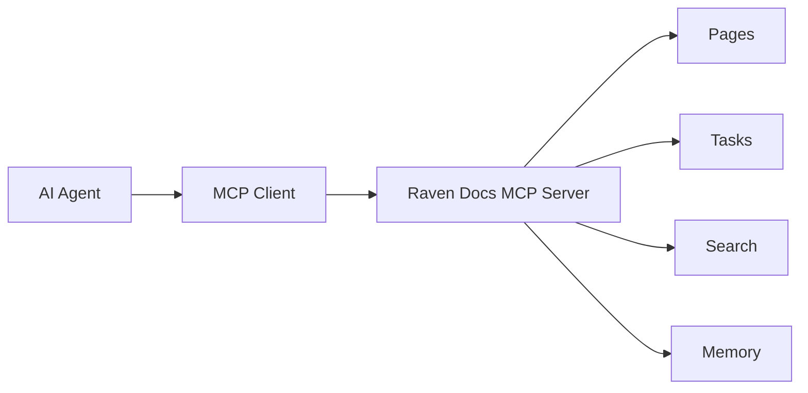

# MCP Server

Raven Docs includes a Model Context Protocol (MCP) server that allows AI agents to interact with your knowledge base.

## What is MCP?

The Model Context Protocol is a standard for connecting AI assistants to external tools and data sources. It enables AI agents to:

- Read and search your documentation
- Create and update content
- Manage tasks and projects
- Store persistent memory

## Architecture



## Key Features

### 100+ Tools

Access all Raven Docs functionality through standardized tools:

| Category | Tools |
|----------|-------|
| Spaces | Create, list, update, delete spaces |
| Pages | Full CRUD, history, search |
| Tasks | Manage tasks and projects |
| Users | List and manage users |
| Search | Full-text search |
| Memory | Store and query agent memory |

### Tool Discovery

Agents can search for relevant tools without loading the entire catalog:

```json
{
  "name": "tool_search",
  "arguments": {
    "query": "create page",
    "limit": 5
  }
}
```

### Agent Memory

Store persistent context between conversations:

```json
{
  "name": "memory_ingest",
  "arguments": {
    "workspaceId": "ws_123",
    "content": "User prefers formal documentation style",
    "tags": ["preferences", "style"]
  }
}
```

## Use Cases

### AI Documentation Assistant

Build an AI assistant that can answer questions using your documentation:

```typescript
const response = await agent.run({
  messages: [
    { role: 'user', content: 'How do I set up authentication?' }
  ],
  tools: mcpTools,
});
// Agent searches docs and provides answer with sources
```

### Automated Documentation Updates

Keep documentation in sync with code changes:

```typescript
// When API changes are detected
await mcpClient.callTool('page_update', {
  pageId: 'api-reference',
  content: generateApiDocs(newSchema),
});
```

### Intelligent Chatbot

Create a chatbot with full knowledge of your product:

```typescript
// Chatbot uses MCP to search knowledge base
const results = await mcpClient.callTool('search_query', {
  workspaceId: 'ws_123',
  query: userQuestion,
});
```

### Research Agents

Build agents that can research topics across your docs:

```typescript
await mcpClient.callTool('research_create', {
  workspaceId: 'ws_123',
  spaceId: 'space_456',
  topic: 'competitor analysis',
});
```

## Quick Start

1. Get an API key from **Settings** → **API Keys**
2. Configure your MCP client
3. Start using tools

```json
{
  "mcpServers": {
    "raven-docs": {
      "url": "http://localhost:3000/api/mcp-standard",
      "headers": {
        "Authorization": "Bearer YOUR_API_KEY"
      }
    }
  }
}
```

See the [Quickstart Guide](/mcp/quickstart) for detailed setup.

## Endpoints

| Endpoint | Description |
|----------|-------------|
| `POST /mcp-standard/initialize` | Initialize connection |
| `POST /mcp-standard/list_tools` | List all tools |
| `POST /mcp-standard/search_tools` | Search for tools |
| `POST /mcp-standard/call_tool` | Execute a tool |
| `POST /mcp-standard/list_categories` | List tool categories |

## Related

- [Quickstart](/mcp/quickstart) - Get started in 5 minutes
- [Tool Search](/mcp/tools/tool-search) - Discover tools
- [Authentication](/mcp/authentication) - Configure access
- [Examples](/mcp/examples) - Code examples
