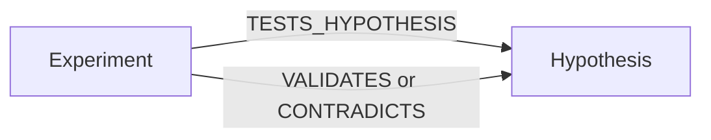

# Experiment Tools

Tools for registering, tracking, and completing experiments linked to hypotheses.

## Available Tools

### experiment_register

Register a new experiment, optionally linked to a hypothesis. Creates a typed page with `pageType: 'experiment'` and a `TESTS_HYPOTHESIS` edge in the research graph.

```json
{
  "name": "experiment_register",
  "arguments": {
    "workspaceId": "ws_123",
    "spaceId": "space_456",
    "title": "Redis cache benchmark under load",
    "hypothesisId": "page_hyp_123",
    "method": "Load test /api/search with 1000 concurrent users, with and without Redis"
  }
}
```

**Arguments:**

| Argument | Type | Required | Description |
|----------|------|----------|-------------|
| `workspaceId` | string | Yes | Workspace ID |
| `spaceId` | string | Yes | Space ID |
| `title` | string | Yes | Experiment title |
| `hypothesisId` | string | No | ID of the hypothesis being tested |
| `method` | string | No | Description of the experimental method |

**Response:**

```json
{
  "page": {
    "id": "page_exp_456",
    "title": "Redis cache benchmark under load",
    "pageType": "experiment",
    "metadata": {
      "status": "planned",
      "hypothesisId": "page_hyp_123",
      "method": "Load test /api/search with 1000 concurrent users..."
    }
  },
  "graphEdge": "TESTS_HYPOTHESIS"
}
```

### experiment_complete

Complete an experiment with results. If `passedPredictions` is true, a `VALIDATES` edge is created from the experiment to the hypothesis. If false, a `CONTRADICTS` edge is created.

```json
{
  "name": "experiment_complete",
  "arguments": {
    "workspaceId": "ws_123",
    "pageId": "page_exp_456",
    "results": {
      "p95Before": 800,
      "p95After": 350,
      "cacheHitRate": 0.87,
      "memoryUsage": "384MB"
    },
    "passedPredictions": true,
    "unexpectedObservations": [
      "Cold start latency spiked to 1200ms for first 30 seconds"
    ]
  }
}
```

**Arguments:**

| Argument | Type | Required | Description |
|----------|------|----------|-------------|
| `workspaceId` | string | Yes | Workspace ID |
| `pageId` | string | Yes | Experiment page ID |
| `results` | object | Yes | Experiment results (freeform) |
| `passedPredictions` | boolean | No | Whether predictions were confirmed |
| `unexpectedObservations` | string[] | No | Any unexpected observations |

**Response:**

```json
{
  "page": {
    "id": "page_exp_456",
    "pageType": "experiment",
    "metadata": {
      "status": "completed",
      "results": { "p95Before": 800, "p95After": 350 },
      "passedPredictions": true,
      "completedAt": "2024-01-15T14:30:00Z"
    }
  },
  "graphEdge": "VALIDATES"
}
```

### experiment_update

Update an experiment's status or metadata.

```json
{
  "name": "experiment_update",
  "arguments": {
    "workspaceId": "ws_123",
    "pageId": "page_exp_456",
    "status": "running",
    "metadata": {
      "startedAt": "2024-01-15T10:00:00Z"
    }
  }
}
```

**Arguments:**

| Argument | Type | Required | Description |
|----------|------|----------|-------------|
| `workspaceId` | string | Yes | Workspace ID |
| `pageId` | string | Yes | Experiment page ID |
| `status` | string | No | New status |
| `metadata` | object | No | Metadata fields to update |

## Experiment Statuses

| Status | Description |
|--------|-------------|
| `planned` | Experiment is designed but not started |
| `running` | Experiment is currently in progress |
| `completed` | Experiment is done, results recorded |
| `failed` | Experiment could not be completed |

## Graph Edges

When experiments are registered and completed, the system automatically manages edges in the research graph:

| Event | Edge Created | Direction |
|-------|-------------|-----------|
| Register with `hypothesisId` | `TESTS_HYPOTHESIS` | Experiment → Hypothesis |
| Complete with `passedPredictions: true` | `VALIDATES` | Experiment → Hypothesis |
| Complete with `passedPredictions: false` | `CONTRADICTS` | Experiment → Hypothesis |



## Related

- [Hypothesis Tools](/mcp/tools/hypothesis) - Create and manage hypotheses
- [Relationship Tools](/mcp/tools/relationship) - Manage graph edges directly
- [Pattern Tools](/mcp/tools/pattern) - Automatic pattern detection
- [Research Intelligence Guide](/guides/research-intelligence) - Full system overview
