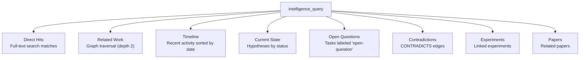

# Intelligence Tools

Tools for querying the research intelligence context assembly system. The intelligence query assembles a structured context bundle from hypotheses, experiments, the knowledge graph, and detected patterns.

## Available Tools

### intelligence_query

Query the research intelligence context — "What do we know about X?"

This tool assembles a comprehensive context bundle by searching across typed pages, the research graph, and pattern detections to answer a natural-language query.

```json
{
  "name": "intelligence_query",
  "arguments": {
    "workspaceId": "ws_123",
    "query": "What do we know about API caching performance?",
    "spaceId": "space_456"
  }
}
```

**Arguments:**

| Argument | Type | Required | Description |
|----------|------|----------|-------------|
| `workspaceId` | string | Yes | Workspace ID |
| `query` | string | Yes | Natural-language query |
| `spaceId` | string | No | Optional space filter |

**Response:**

```json
{
  "context": {
    "query": "What do we know about API caching performance?",
    "directHits": [
      {
        "id": "page_hyp_123",
        "title": "Caching reduces API latency by 50%",
        "pageType": "hypothesis"
      }
    ],
    "relatedWork": [
      {
        "id": "page_789",
        "title": "Caching Architecture Decisions",
        "pageType": "finding"
      }
    ],
    "timeline": [
      {
        "id": "page_exp_456",
        "title": "Redis cache benchmark",
        "updatedAt": "2024-01-15T14:30:00Z"
      }
    ],
    "currentState": {
      "validated": [
        { "id": "page_hyp_123", "title": "Caching reduces API latency by 50%" }
      ],
      "refuted": [],
      "testing": [],
      "open": []
    },
    "openQuestions": [
      {
        "id": "task_oq_123",
        "title": "What is the cache invalidation strategy?",
        "status": "todo",
        "priority": "medium",
        "labels": ["open-question"]
      }
    ],
    "contradictions": [
      {
        "from": "page_hyp_123",
        "to": "page_hyp_456",
        "type": "CONTRADICTS"
      }
    ],
    "experiments": [
      {
        "id": "page_exp_456",
        "title": "Redis cache benchmark",
        "pageType": "experiment"
      }
    ],
    "papers": []
  }
}
```

## Context Bundle Structure

The intelligence query assembles context from multiple sources:



| Section | Source | Description |
|---------|--------|-------------|
| `directHits` | Full-text search | Pages matching the query via tsquery |
| `relatedWork` | Knowledge graph | Pages connected via graph traversal (max depth 2) |
| `timeline` | Page metadata | All matched pages sorted by last update |
| `currentState` | Typed pages | Hypotheses grouped by status (validated, refuted, testing, open) |
| `openQuestions` | Tasks | Tasks labeled "open-question" or matching the query |
| `contradictions` | Memgraph | CONTRADICTS edges involving result pages |
| `experiments` | Typed pages | Experiments related to matched hypotheses |
| `papers` | Typed pages | Papers and formal publications |

## Use Cases

### Agent Context Injection

Use `intelligence_query` to give AI agents full research context before they take action:

```typescript
// Before an agent writes a recommendation
const context = await mcp.call("intelligence_query", {
  workspaceId: "ws_123",
  query: "database migration strategies"
});

// Agent now has hypotheses, evidence, and patterns to inform its response
```

### Research Status Check

Quickly understand the state of knowledge in a domain:

```typescript
const context = await mcp.call("intelligence_query", {
  workspaceId: "ws_123",
  query: "authentication security",
  spaceId: "space_security"
});

// See which hypotheses are validated, what's still open, any contradictions
```

## Related

- [Hypothesis Tools](/mcp/tools/hypothesis) - Create and manage hypotheses
- [Experiment Tools](/mcp/tools/experiment) - Register experiments
- [Pattern Tools](/mcp/tools/pattern) - Pattern detection
- [Research Intelligence Guide](/guides/research-intelligence) - Full system overview
