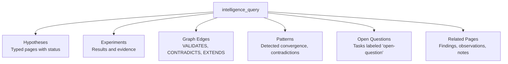

# Intelligence Tools

Tools for querying the research intelligence context assembly system. The intelligence query assembles a structured context bundle from hypotheses, experiments, the knowledge graph, and detected patterns.

## Available Tools

### intelligence_query

Query the research intelligence context — "What do we know about X?"

This tool assembles a comprehensive context bundle by searching across typed pages, the research graph, and pattern detections to answer a natural-language query.

```json
{
  "name": "intelligence_query",
  "arguments": {
    "workspaceId": "ws_123",
    "query": "What do we know about API caching performance?",
    "spaceId": "space_456"
  }
}
```

**Arguments:**

| Argument | Type | Required | Description |
|----------|------|----------|-------------|
| `workspaceId` | string | Yes | Workspace ID |
| `query` | string | Yes | Natural-language query |
| `spaceId` | string | No | Optional space filter |

**Response:**

```json
{
  "context": {
    "query": "What do we know about API caching performance?",
    "hypotheses": [
      {
        "id": "page_hyp_123",
        "title": "Caching reduces API latency by 50%",
        "status": "validated",
        "formalStatement": "Adding Redis caching will reduce p95 latency...",
        "evidenceCount": 2
      }
    ],
    "experiments": [
      {
        "id": "page_exp_456",
        "title": "Redis cache benchmark",
        "status": "completed",
        "results": { "p95After": 350, "hitRate": 0.87 }
      }
    ],
    "relatedPages": [
      {
        "id": "page_789",
        "title": "Caching Architecture Decisions",
        "pageType": "finding"
      }
    ],
    "graphEdges": [
      {
        "from": "page_exp_456",
        "to": "page_hyp_123",
        "type": "VALIDATES"
      }
    ],
    "patterns": [
      {
        "id": "pat_001",
        "patternType": "convergence",
        "title": "Multiple experiments validate caching hypothesis",
        "severity": "medium"
      }
    ],
    "openQuestions": [
      {
        "id": "task_oq_123",
        "title": "What is the cache invalidation strategy?",
        "status": "todo"
      }
    ]
  }
}
```

## Context Bundle Structure

The intelligence query assembles context from multiple sources:



| Section | Source | Description |
|---------|--------|-------------|
| `hypotheses` | Typed pages | Hypotheses matching the query, with status and evidence count |
| `experiments` | Typed pages | Experiments related to matching hypotheses |
| `relatedPages` | Semantic search | Other typed pages (findings, observations, notes) |
| `graphEdges` | Memgraph | Relationships between matched pages |
| `patterns` | Pattern detections | Relevant detected patterns |
| `openQuestions` | Tasks | Open questions related to the domain |

## Use Cases

### Agent Context Injection

Use `intelligence_query` to give AI agents full research context before they take action:

```typescript
// Before an agent writes a recommendation
const context = await mcp.call("intelligence_query", {
  workspaceId: "ws_123",
  query: "database migration strategies"
});

// Agent now has hypotheses, evidence, and patterns to inform its response
```

### Research Status Check

Quickly understand the state of knowledge in a domain:

```typescript
const context = await mcp.call("intelligence_query", {
  workspaceId: "ws_123",
  query: "authentication security",
  spaceId: "space_security"
});

// See which hypotheses are validated, what's still open, any contradictions
```

## Related

- [Hypothesis Tools](/mcp/tools/hypothesis) - Create and manage hypotheses
- [Experiment Tools](/mcp/tools/experiment) - Register experiments
- [Pattern Tools](/mcp/tools/pattern) - Pattern detection
- [Research Intelligence Guide](/guides/research-intelligence) - Full system overview
