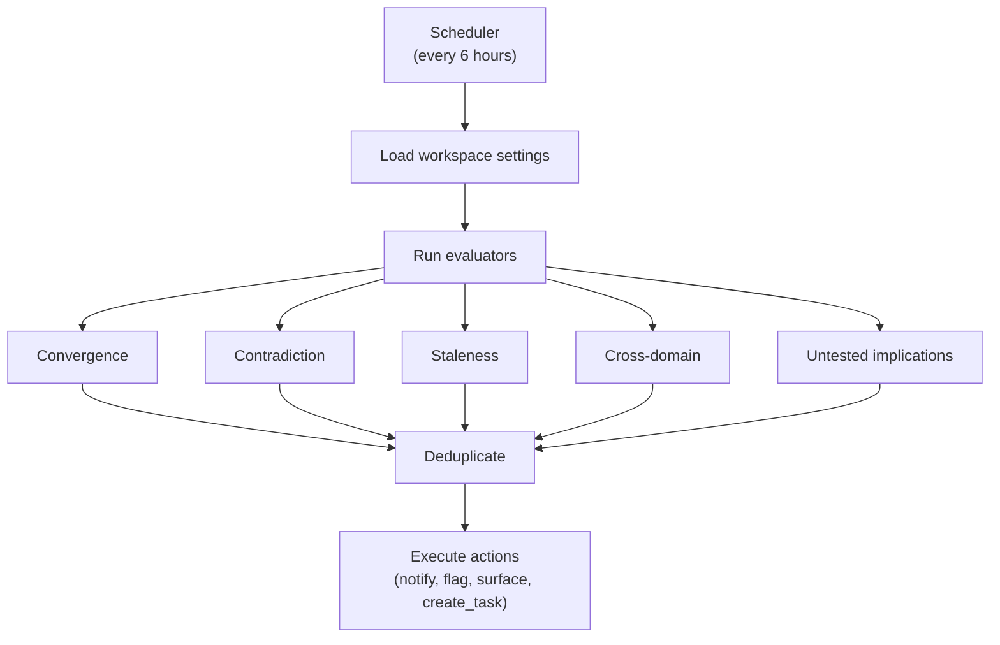

# Pattern Tools

Tools for managing the automated pattern detection engine. The system scans the research graph on a schedule to detect convergence, contradictions, staleness, cross-domain connections, and untested implications.

## Available Tools

### pattern_list

List detected patterns for a workspace.

```json
{
  "name": "pattern_list",
  "arguments": {
    "workspaceId": "ws_123",
    "status": "detected",
    "patternType": "contradiction"
  }
}
```

**Arguments:**

| Argument | Type | Required | Description |
|----------|------|----------|-------------|
| `workspaceId` | string | Yes | Workspace ID |
| `spaceId` | string | No | Filter by space |
| `status` | string | No | Filter by status (`detected`, `acknowledged`, `dismissed`) |
| `patternType` | string | No | Filter by pattern type |

**Response:**

```json
{
  "patterns": [
    {
      "id": "pat_001",
      "patternType": "contradiction",
      "severity": "high",
      "title": "Contradicting hypotheses: Caching vs No-cache",
      "details": {
        "fromPage": "page_hyp_123",
        "fromTitle": "Caching reduces latency by 50%",
        "toPage": "page_hyp_456",
        "toTitle": "Caching adds overhead for small payloads"
      },
      "status": "detected",
      "detectedAt": "2024-01-15T06:00:00Z"
    }
  ]
}
```

### pattern_acknowledge

Acknowledge a detected pattern, indicating it has been reviewed.

```json
{
  "name": "pattern_acknowledge",
  "arguments": {
    "patternId": "pat_001",
    "actionTaken": {
      "notes": "Created a new experiment to resolve the contradiction",
      "experimentId": "page_exp_789"
    }
  }
}
```

**Arguments:**

| Argument | Type | Required | Description |
|----------|------|----------|-------------|
| `patternId` | string | Yes | Pattern ID |
| `actionTaken` | object | No | Details about the action taken |

### pattern_dismiss

Dismiss a detected pattern.

```json
{
  "name": "pattern_dismiss",
  "arguments": {
    "patternId": "pat_001"
  }
}
```

### pattern_run

Manually trigger pattern detection for a workspace. Runs all configured pattern evaluators immediately.

```json
{
  "name": "pattern_run",
  "arguments": {
    "workspaceId": "ws_123"
  }
}
```

**Response:**

```json
{
  "patternsDetected": 3,
  "message": "Pattern detection completed"
}
```

:::info
Pattern detection also runs automatically every 6 hours for workspaces with intelligence enabled.
:::

## Pattern Types

| Type | Severity | Description |
|------|----------|-------------|
| `convergence` | medium | Multiple experiments validate the same hypothesis (default threshold: 3+) |
| `contradiction` | high | Two pages have a `CONTRADICTS` relationship in the graph |
| `staleness` | low | Open questions that haven't been updated in a configurable period |
| `cross_domain` | medium | Connections detected between pages with different domain tags |
| `untested_implication` | medium | A validated hypothesis `EXTENDS` a proposed hypothesis with no testing |
| `intake_gate` | high | Hypothesis marked as "proved" without completing its intake gate checklist |
| `evidence_gap` | medium | Hypothesis with citations or formalizations but fewer than N experiments |
| `reproduction_failure` | high | Experiment with incoming `FAILS_TO_REPRODUCE` edges from other experiments |

## Pattern Statuses

| Status | Description |
|--------|-------------|
| `detected` | Pattern was found by an evaluator |
| `acknowledged` | A user has reviewed and acknowledged the pattern |
| `dismissed` | Pattern was dismissed as not relevant |

## How Detection Works

Pattern detection runs on a schedule (every 6 hours) or can be triggered manually:



### Evaluators

**Convergence** — Finds hypotheses with 3+ validating experiments, suggesting strong evidence.

**Contradiction** — Scans the research graph for `CONTRADICTS` edges between pages.

**Staleness** — Finds open questions (tasks labeled "open-question") not updated within a configurable period.

**Cross-domain** — Detects connections between pages with different domain tags, revealing unexpected relationships.

**Untested implications** — Finds validated hypotheses that `EXTEND` proposed hypotheses with no experiments testing them.

**Intake gate violation** — Flags hypotheses whose claim label is "proved" but whose intake gate checklist hasn't been completed.

**Evidence gap** — Identifies hypotheses that are cited or formalized by other pages but have fewer than the configured number of experiments testing them.

**Reproduction failure** — Detects experiments that have incoming `FAILS_TO_REPRODUCE` edges, indicating another experiment could not reproduce the results.

### Actions

When patterns are detected, configurable actions can be taken:

| Action | Description |
|--------|-------------|
| `notify` | Emit an event for notification systems |
| `flag` | Record the pattern (default behavior) |
| `surface` | Prominently surface the pattern in the dashboard |
| `create_task` | Automatically create a task to address the pattern |

## Configuration

Pattern detection is configured per-workspace via intelligence settings:

```json
{
  "intelligence": {
    "enabled": true,
    "patternRules": [
      {
        "type": "convergence",
        "enabled": true,
        "threshold": 3,
        "action": "surface"
      },
      {
        "type": "contradiction",
        "enabled": true,
        "action": "notify"
      },
      {
        "type": "staleness",
        "enabled": true,
        "maxAgeDays": 14,
        "action": "create_task"
      }
    ]
  }
}
```

## Related

- [Hypothesis Tools](/mcp/tools/hypothesis) - Hypotheses that patterns analyze
- [Relationship Tools](/mcp/tools/relationship) - Graph edges patterns detect
- [Intelligence Tools](/mcp/tools/intelligence) - Query context including patterns
- [Research Intelligence Guide](/guides/research-intelligence) - Full system overview
