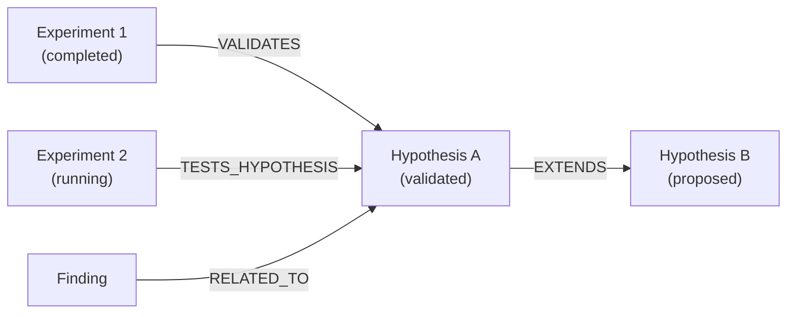

# Relationship Tools

Tools for managing typed relationships between pages in the research knowledge graph. Relationships are stored as directed edges in Memgraph and power the evidence chain, contradiction detection, and intelligence queries.

## Available Tools

### relationship_create

Create a typed relationship between two pages.

```json
{
  "name": "relationship_create",
  "arguments": {
    "workspaceId": "ws_123",
    "fromPageId": "page_hyp_123",
    "toPageId": "page_hyp_456",
    "type": "EXTENDS",
    "metadata": {
      "confidence": 0.85,
      "notes": "Builds on the caching hypothesis for read-heavy workloads"
    }
  }
}
```

**Arguments:**

| Argument | Type | Required | Description |
|----------|------|----------|-------------|
| `workspaceId` | string | Yes | Workspace ID |
| `fromPageId` | string | Yes | Source page ID |
| `toPageId` | string | Yes | Target page ID |
| `type` | string | Yes | Relationship type |
| `metadata` | object | No | Optional relationship metadata |

**Response:**

```json
{
  "edge": {
    "from": "page_hyp_123",
    "to": "page_hyp_456",
    "type": "EXTENDS",
    "metadata": { "confidence": 0.85 }
  }
}
```

### relationship_remove

Remove a relationship between two pages.

```json
{
  "name": "relationship_remove",
  "arguments": {
    "workspaceId": "ws_123",
    "fromPageId": "page_hyp_123",
    "toPageId": "page_hyp_456",
    "type": "EXTENDS"
  }
}
```

**Arguments:**

| Argument | Type | Required | Description |
|----------|------|----------|-------------|
| `workspaceId` | string | Yes | Workspace ID |
| `fromPageId` | string | Yes | Source page ID |
| `toPageId` | string | Yes | Target page ID |
| `type` | string | Yes | Relationship type to remove |

### relationship_list

List relationships for a page.

```json
{
  "name": "relationship_list",
  "arguments": {
    "workspaceId": "ws_123",
    "pageId": "page_hyp_123",
    "direction": "both",
    "types": ["VALIDATES", "CONTRADICTS"]
  }
}
```

**Arguments:**

| Argument | Type | Required | Description |
|----------|------|----------|-------------|
| `workspaceId` | string | Yes | Workspace ID |
| `pageId` | string | Yes | Page ID to get relationships for |
| `direction` | string | No | `outgoing`, `incoming`, or `both` (default: `both`) |
| `types` | string[] | No | Filter by relationship types |

**Response:**

```json
{
  "edges": [
    {
      "from": "page_exp_456",
      "to": "page_hyp_123",
      "type": "VALIDATES",
      "metadata": {}
    },
    {
      "from": "page_hyp_123",
      "to": "page_hyp_789",
      "type": "EXTENDS",
      "metadata": { "confidence": 0.85 }
    }
  ]
}
```

## Relationship Types

| Type | Description | Example |
|------|-------------|---------|
| `VALIDATES` | Evidence supports a hypothesis | Experiment → Hypothesis |
| `CONTRADICTS` | Evidence contradicts a hypothesis | Experiment → Hypothesis |
| `TESTS_HYPOTHESIS` | An experiment tests a hypothesis | Experiment → Hypothesis |
| `EXTENDS` | One finding extends another | Hypothesis → Hypothesis |
| `REFINES` | A more specific version | Finding → Finding |
| `DEPENDS_ON` | Logical dependency | Hypothesis → Hypothesis |
| `RELATED_TO` | General association | Any → Any |

## Knowledge Graph

Relationships form a directed knowledge graph stored in Memgraph:



The graph is used by:

- **Evidence chains** — `hypothesis_get` traverses the graph to find all supporting/contradicting evidence
- **Contradiction detection** — Pattern detection scans for `CONTRADICTS` edges
- **Convergence detection** — Counts `VALIDATES` edges to find well-supported hypotheses
- **Intelligence queries** — Context assembly traverses relationships to build comprehensive context bundles

## Related

- [Hypothesis Tools](/mcp/tools/hypothesis) - Create hypotheses
- [Experiment Tools](/mcp/tools/experiment) - Register experiments
- [Pattern Tools](/mcp/tools/pattern) - Automatic pattern detection
- [Research Intelligence Guide](/guides/research-intelligence) - Full system overview
