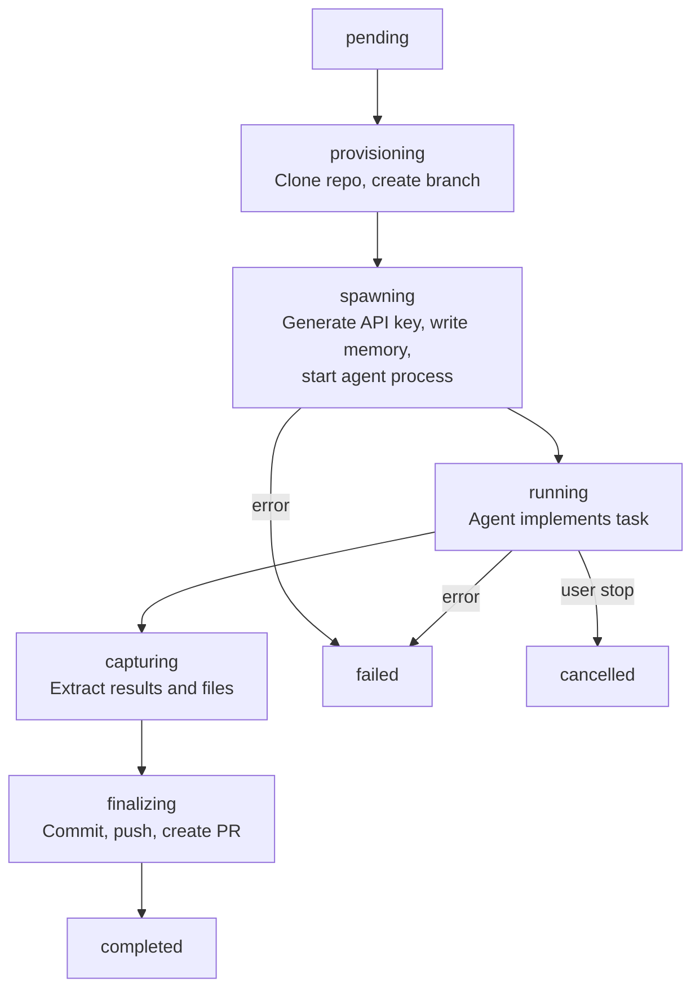

# Swarm Tools

Tools for executing coding tasks via agent swarms. The coding swarm system provisions isolated git workspaces, spawns coding agents, and handles the full lifecycle from task execution through PR creation.

## Available Tools

### swarm_execute

Start a coding swarm execution. Clones the target repository, creates a feature branch, spawns an agent, and sends the task.

```json
{
  "name": "swarm_execute",
  "arguments": {
    "workspaceId": "ws_123",
    "repoUrl": "https://github.com/org/repo",
    "taskDescription": "Add input validation to the user registration endpoint",
    "agentType": "claude-code",
    "baseBranch": "main",
    "taskContext": "The endpoint is in src/routes/auth.ts. Use zod for validation."
  }
}
```

**Arguments:**

| Argument | Type | Required | Description |
|----------|------|----------|-------------|
| `workspaceId` | string | Yes | Workspace ID |
| `repoUrl` | string | Yes | Git repository URL to clone |
| `taskDescription` | string | Yes | What the agent should implement |
| `spaceId` | string | No | Space to associate with |
| `experimentId` | string | No | Link execution to a research experiment |
| `agentType` | string | No | Agent type (`claude-code`, `codex`, `gemini`, `aider`). Defaults to `claude-code` |
| `baseBranch` | string | No | Branch to base work on (default: `main`) |
| `taskContext` | string | No | Additional context for the agent |
| `triggeredBy` | string | No | What triggered this execution (e.g., `experiment`, `manual`) |

**Response:**

```json
{
  "executionId": "exec_abc123",
  "status": "pending"
}
```

### swarm_status

Get the current status and results of a coding swarm execution.

```json
{
  "name": "swarm_status",
  "arguments": {
    "executionId": "exec_abc123"
  }
}
```

**Response:**

```json
{
  "id": "exec_abc123",
  "status": "completed",
  "agentType": "claude-code",
  "agentId": "agent_456",
  "taskDescription": "Add input validation to the user registration endpoint",
  "outputSummary": "Added zod validation schema for registration payload...",
  "exitCode": 0,
  "results": {
    "prUrl": "https://github.com/org/repo/pull/42",
    "branchName": "swarm/exec-abc123",
    "commitCount": 2
  },
  "filesChanged": ["src/routes/auth.ts", "src/schemas/user.ts"],
  "startedAt": "2024-01-15T10:00:00Z",
  "completedAt": "2024-01-15T10:15:00Z",
  "createdAt": "2024-01-15T09:59:00Z"
}
```

### swarm_list

List coding swarm executions in a workspace.

```json
{
  "name": "swarm_list",
  "arguments": {
    "workspaceId": "ws_123",
    "status": "completed",
    "limit": 10
  }
}
```

**Arguments:**

| Argument | Type | Required | Description |
|----------|------|----------|-------------|
| `workspaceId` | string | Yes | Workspace ID |
| `status` | string | No | Filter by status |
| `experimentId` | string | No | Filter by experiment |
| `limit` | number | No | Max results (default: 20) |

**Response:**

```json
{
  "executions": [
    {
      "id": "exec_abc123",
      "status": "completed",
      "agentType": "claude-code",
      "taskDescription": "Add input validation...",
      "experimentId": null,
      "startedAt": "2024-01-15T10:00:00Z",
      "completedAt": "2024-01-15T10:15:00Z",
      "createdAt": "2024-01-15T09:59:00Z"
    }
  ]
}
```

### swarm_stop

Stop a running coding swarm execution.

```json
{
  "name": "swarm_stop",
  "arguments": {
    "executionId": "exec_abc123"
  }
}
```

**Response:**

```json
{
  "success": true,
  "message": "Execution cancelled"
}
```

### swarm_logs

Get terminal output logs from a coding swarm execution.

```json
{
  "name": "swarm_logs",
  "arguments": {
    "executionId": "exec_abc123",
    "limit": 100
  }
}
```

**Arguments:**

| Argument | Type | Required | Description |
|----------|------|----------|-------------|
| `executionId` | string | Yes | Execution ID |
| `limit` | number | No | Max lines to return |

## Execution Lifecycle

The coding swarm follows a multi-phase lifecycle:



| Status | Description |
|--------|-------------|
| `pending` | Execution created, waiting for processing |
| `provisioning` | Cloning repository, creating feature branch |
| `spawning` | Generating credentials, writing agent memory file, starting agent |
| `running` | Agent is actively working on the task |
| `capturing` | Agent finished, extracting results and changed files |
| `finalizing` | Committing changes, pushing branch, creating pull request |
| `completed` | Execution finished successfully |
| `failed` | Execution encountered an error |
| `cancelled` | Execution was stopped by the user |

## How It Works

### Workspace Preparation

Before an agent starts, the system prepares its workspace:

1. **MCP API Key** — Generates a scoped API key so the agent can call back to Raven
2. **Memory File** — Writes a `.raven-memory.md` file with workspace context, long-term memory, and API documentation
3. **Environment Variables** — Sets `MCP_API_KEY`, `MCP_SERVER_URL`, `RAVEN_WORKSPACE_ID`, and other credentials
4. **Approval Config** — Pre-configures approval settings if auto-approval is enabled

### Agent Execution

The agent runs in an isolated PTY session with full terminal access. It receives the task description and memory file, then works autonomously to implement the changes.

### Finalization

After the agent completes:
1. All changes are staged and committed
2. The feature branch is pushed to the remote
3. A pull request is created with the task description as the body
4. Results (PR URL, files changed, output summary) are recorded

## Example: Full Workflow

```typescript
// 1. Start execution
const { executionId } = await mcp.call("swarm_execute", {
  workspaceId: "ws_123",
  repoUrl: "https://github.com/org/repo",
  taskDescription: "Add unit tests for the UserService class",
  agentType: "claude-code"
});

// 2. Poll for completion
let status;
do {
  await sleep(10000);
  status = await mcp.call("swarm_status", { executionId });
} while (!["completed", "failed", "cancelled"].includes(status.status));

// 3. Check results
if (status.status === "completed") {
  console.log(`PR created: ${status.results.prUrl}`);
  console.log(`Files changed: ${status.filesChanged.join(", ")}`);
}
```

## Linking to Experiments

Coding swarm executions can be linked to research experiments for traceability:

```typescript
// Create an experiment
const exp = await mcp.call("experiment_register", {
  workspaceId: "ws_123",
  spaceId: "space_456",
  title: "Test rate limiting implementation",
  hypothesisId: "page_hyp_123"
});

// Execute with experiment link
await mcp.call("swarm_execute", {
  workspaceId: "ws_123",
  repoUrl: "https://github.com/org/repo",
  taskDescription: "Implement rate limiting middleware",
  experimentId: exp.page.id,
  triggeredBy: "experiment"
});
```

## Related

- [Agent Runtime Guide](/guides/agent-runtime) - Configure agent hosting
- [Experiment Tools](/mcp/tools/experiment) - Link executions to experiments
- [Research Intelligence Guide](/guides/research-intelligence) - Full system overview
