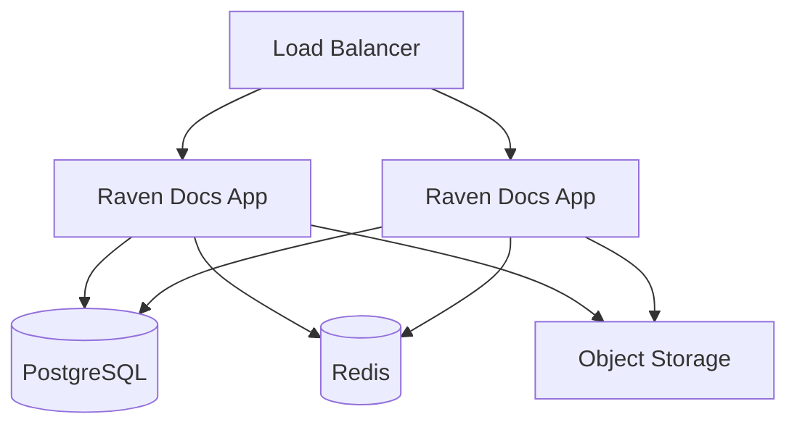

# Self-Hosting

Run Raven Docs on your own infrastructure for full control over your data.

## Deployment Options

| Option | Best For |
|--------|----------|
| [Docker](/self-hosting/docker) | Quick setup, small teams |
| [Kubernetes](/self-hosting/kubernetes) | Production, scaling |

## Requirements

### Minimum

- 2 CPU cores
- 4 GB RAM
- 20 GB storage
- PostgreSQL 15+
- Redis 7+

### Recommended (Production)

- 4+ CPU cores
- 8+ GB RAM
- 100 GB SSD storage
- PostgreSQL with replication
- Redis cluster
- Load balancer

## Architecture



## Quick Start

### Docker Compose

```bash
# Clone the repo
git clone https://github.com/HaruHunab1320/raven-docs.git
cd raven-docs

# Configure environment
cp .env.example .env
# Edit .env with your settings

# Start services
docker compose up -d
```

### Kubernetes

See the [Kubernetes guide](/self-hosting/kubernetes) for deploying with Helm charts included in the repository.

## Environment Variables

| Variable | Required | Description |
|----------|----------|-------------|
| `DATABASE_URL` | Yes | PostgreSQL connection string |
| `REDIS_URL` | Yes | Redis connection string |
| `APP_SECRET` | Yes | Secret for encryption |
| `APP_URL` | Yes | Public URL of your instance |

See [Configuration](/self-hosting/configuration) for all options.

## Upgrading

1. Check the [Changelog](/changelog) for breaking changes
2. Back up your database
3. Pull the latest changes
4. Run migrations
5. Restart services

```bash
# Docker
git pull
docker compose pull
docker compose up -d
```

## Support

For community support:
- Open an issue on [GitHub](https://github.com/HaruHunab1320/raven-docs/issues)
- Join our [Discord](https://discord.gg/jEmMBA2S)
