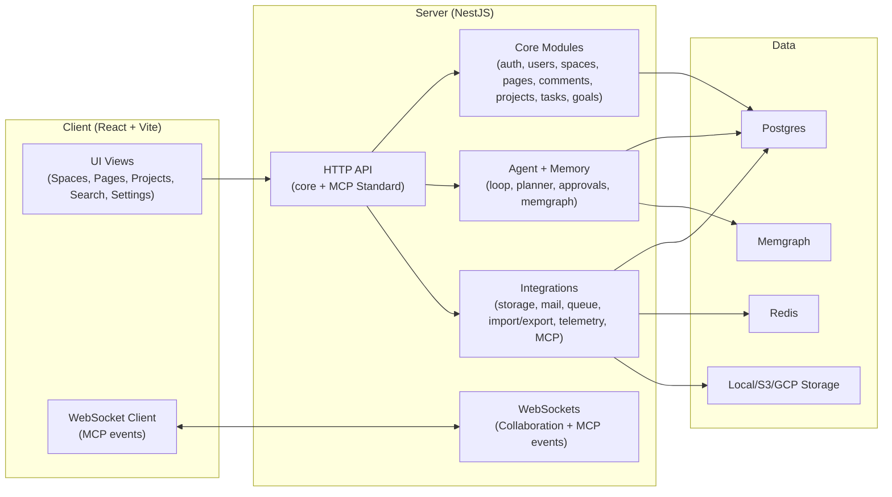
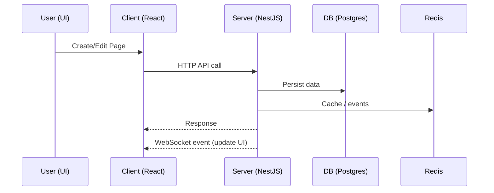

# Architecture Overview

This document describes the current Raven Docs architecture and system boundaries, with emphasis on MCP, agent workflows, and real-time collaboration.

## System Overview

Raven Docs is a monorepo with two primary apps and shared packages:

- Backend: NestJS server (`apps/server`)
- Frontend: React + Vite client (`apps/client`)
- Shared packages: editor extension, enterprise features (`packages/*`)

### High-Level Diagram



## Monorepo Layout

```
apps/
  client/            React UI (Vite)
  server/            NestJS API + WebSockets
packages/
  editor-ext/        Editor extension package
  ee/                Enterprise modules
docs/                Project and MCP documentation
```

## Backend Architecture (NestJS)

### Entry Points
- App module: `apps/server/src/app.module.ts`
- Main bootstrap: `apps/server/src/main.ts`

### Core Modules
Located under `apps/server/src/core`:
- `auth`, `user`, `workspace`, `space`, `page`, `comment`, `group`
- `search`, `attachment`, `project`, `task`, `goal`
- Each module exposes controller(s), service(s), and repository layer.

### Integrations
Located under `apps/server/src/integrations`:
- `storage` (local GCP or S3)
- `mail` (SMTP / Postmark / Resend)
- `queue`, `telemetry`, `security`, `health`
- `import`, `export`, `static`
- MCP:
  - Standard MCP protocol: `apps/server/src/integrations/mcp-standard`
  - MCP core services + handlers: `apps/server/src/integrations/mcp`
- Memgraph integration: `apps/server/src/integrations/memgraph`
- AI integration: `apps/server/src/integrations/ai`

### Real-time Systems
- Collaboration via Hocuspocus/Yjs: `apps/server/src/collaboration`
- MCP event socket gateway: `apps/server/src/integrations/mcp/mcp-websocket.gateway.ts`

## Frontend Architecture (React)

### Entry Points
- App shell: `apps/client/src/App.tsx`
- Bootstrap: `apps/client/src/main.tsx`

### Feature Areas
Located under `apps/client/src/features`:
- `auth`, `space`, `page`, `comment`, `attachment`, `search`, `workspace`, `user`
- `project` (projects + tasks UI)
- `websocket` (MCP event subscriptions)

### Editor System
- Tiptap-based editor with extensions
- Shared editor extension package: `packages/editor-ext`

## MCP / AI Integration

Two paths exist:

1) MCP Standard Integration (`apps/server/src/integrations/mcp-standard`)
   - Built-in server endpoints at `/api/mcp-standard/*`.
   - Uses MCP API key auth and internal MCP services.
   - Approval policy enforced by the MCP approval service + agent policy rules.

2) Agent Systems (`apps/server/src/core/agent`, `apps/server/src/core/agent-memory`)
   - Autonomous loop and daily planner (Gemini).
   - Agent memory stored in Postgres + Memgraph.
   - Approval workflow with UI surfaces in Today/Insights.

## Data Flow Summary



## Current Status Notes

- Core systems are in place and wired.
- MCP Standard integration appears complete and is preferred over the legacy bridge.
- Project management system is implemented at API + UI; page task list sync
  uses stable pageTaskId values with legacy title fallback.
- Agent memory + autonomy are live; approvals are required for sensitive actions.
- Documentation overlaps and needs consolidation.

## Known Gaps (from code scan)

- Task list extraction from pages uses stable pageTaskId values with legacy
  title fallback; validate duplicate-title legacy cases in QA.
- Some docs refer to legacy files at repo root and need cleanup/consolidation.

## Workflow Notes

- Primary GTD flow: capture → triage → plan → execute → review.
- Daily Focus and Weekly Review are the main planning surfaces.
- Agent loop suggests actions that are gated by policy and approvals.

See `docs/Workflows.md` for the full workflow map and use cases.
